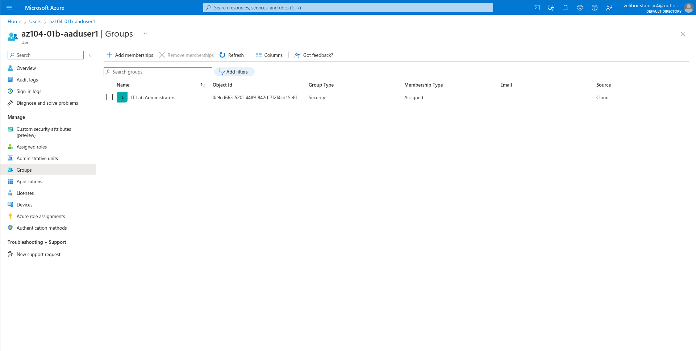

## Lab 01 - Manage Azure Active Directory Identities

### Lab scenario  
In order to allow Contoso users to authenticate by using Azure AD, you have been tasked with provisioning users and group accounts. Membership of the groups should be updated automatically based on the user job titles. You also need to create a test Azure AD tenant with a test user account and grant that account limited permissions to resources in the Contoso Azure subscription.  

### Objectives  
In this lab, you will:

* Task 1: Create and configure Azure AD users
* Task 2: Create Azure AD groups with assigned and dynamic membership
* Task 3: Create an Azure Active Directory (AD) tenant (Optional - lab  environment issue)  
* Task 4: Manage Azure AD guest users (Optional - lab environment issue)

* [Detailed explanation and actions required for each step](https://microsoftlearning.github.io/AZ-104-MicrosoftAzureAdministrator/Instructions/Labs/LAB_01-Manage_Azure_AD_Identities.html)

