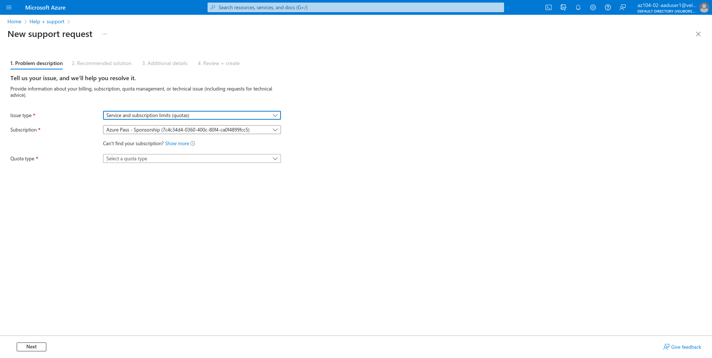

## Lab 02a - Manage Subscriptions and RBAC

### Lab scenario  
This lab requires permissions to create Azure Active Directory (Azure AD) users, create custom Azure Role Based Access Control (RBAC) roles, and assign these roles to Azure AD users. Not all lab hosters may provide this capability. Ask your instructor for the availability of this lab. 

### Objectives  
In this lab, you will:

* Task 1: Implement Management Groups
* Task 2: Create custom RBAC roles
* Task 3: Assign RBAC roles

* [Detailed explanation and actions required for each step](https://microsoftlearning.github.io/AZ-104-MicrosoftAzureAdministrator/Instructions/Labs/LAB_02a_Manage_Subscriptions_and_RBAC.html)

