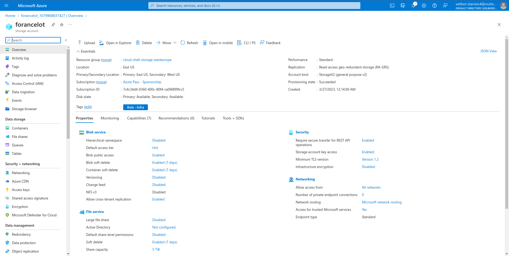

## Lab 02b - Manage Governance via Azure Policy

### Lab scenario  
In order to improve management of Azure resources in Contoso, you have been tasked with implementing the following functionality:

* tagging resource groups that include only infrastructure resources (such as Cloud Shell storage accounts)

* ensuring that only properly tagged infrastructure resources can be added to infrastructure resource groups

* remediating any non-compliant resources

### Objectives  
In this lab, you will:

* Task 1: Create and assign tags via the Azure portal
* Task 2: Enforce tagging via an Azure policy
* Task 3: Apply tagging via an Azure policy

* [Detailed explanation and actions required for each step](https://microsoftlearning.github.io/AZ-104-MicrosoftAzureAdministrator/Instructions/Labs/LAB_02b-Manage_Governance_via_Azure_Policy.html)

