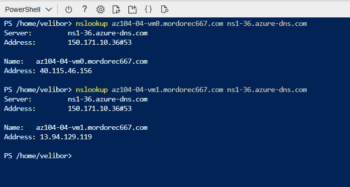

## Lab 04 - Implement Virtual Networking  <br /> Student lab manual

### Lab scenario  
You need to explore Azure virtual networking capabilities. To start, you plan to create a virtual network in Azure that will host a couple of Azure virtual machines. Since you intend to implement network-based segmentation, you will deploy them into different subnets of the virtual network. You also want to make sure that their private and public IP addresses will not change over time. To comply with Contoso security requirements, you need to protect public endpoints of Azure virtual machines accessible from Internet. Finally, you need to implement DNS name resolution for Azure virtual machines both within the virtual network and from Internet.  

### Objectives  
In this lab, you will:

* Task 1: Create and configure a virtual network
* Task 2: Deploy virtual machines into the virtual network
* Task 3: Configure private and public IP addresses of Azure VMs
* Task 4: Configure network security groups
* Task 5: Configure Azure DNS for internal name resolution
* Task 6: Configure Azure DNS for external name resolution  

* [Detailed explanation and actions required for each step](https://microsoftlearning.github.io/AZ-104-MicrosoftAzureAdministrator/Instructions/Labs/LAB_04-Implement_Virtual_Networking.html)  

---

15. From the Cloud Shell pane, run the following to test external name resolution of the az104-04-vm0 DNS record set in the the newly created DNS zone (replace the placeholder [Name server 1] with the name of Name server 1 you noted earlier in this task and the [domain name] placeholder with the name of the DNS domain you created earlier in this task):  

    ```poweshell
    nslookup az104-04-vm0.[domain name] [Name server 1]
    ```

17. From the Cloud Shell pane, run the following to test external name resolution of the az104-04-vm1 DNS record set in the the newly created DNS zone (replace the placeholder [Name server 1] with the name of Name server 1 you noted earlier in this task and the [domain name] placeholder with the name of the DNS domain you created earlier in this task):  

    ```poweshell
    nslookup az104-04-vm1.[domain name] [Name server 1]
    ```

     
