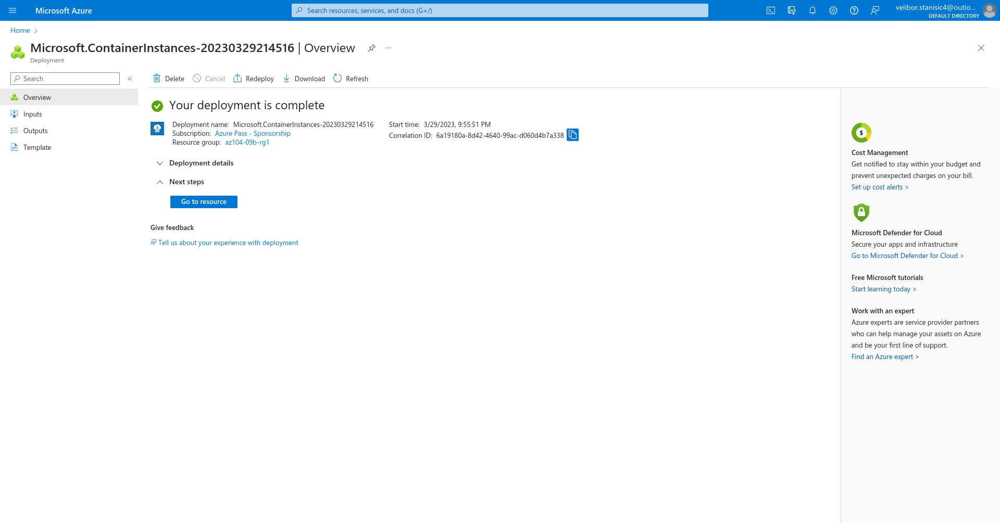
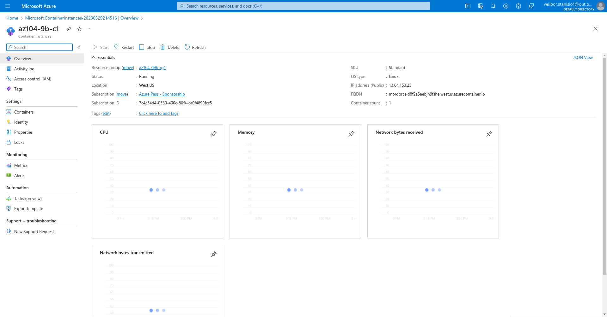
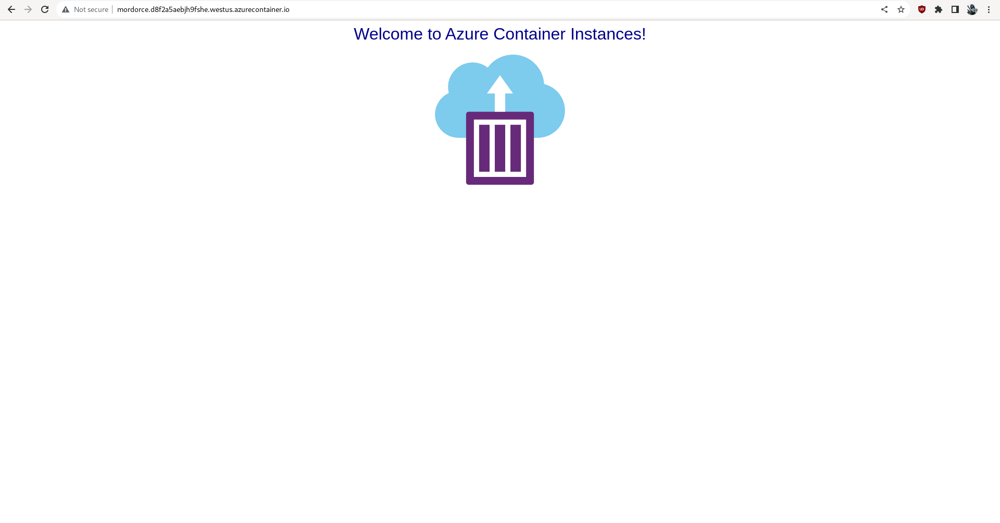
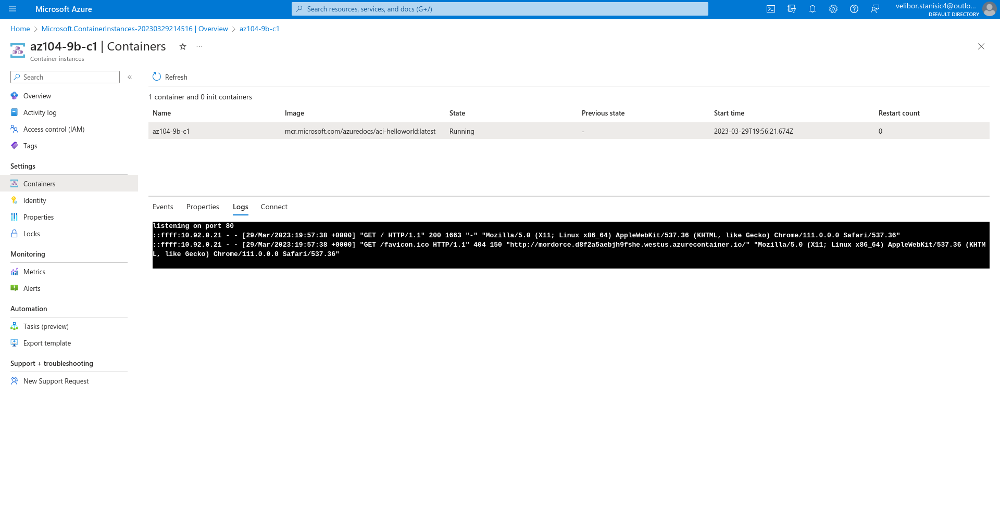

## Lab 09b - Implement Azure Container Instances   Student lab manual

### Lab scenario  
Contoso wants to find a new platform for its virtualized workloads. You identified a number of container images that can be leveraged to accomplish this objective. Since you want to minimize container management, you plan to evaluate the use of Azure Container Instances for deployment of Docker images.  

### Objectives  
In this lab, you will:

* Task 1: Deploy a Docker image by using the Azure Container Instance  
* Task 2: Review the functionality of the Azure Container Instance  
* [Detailed explanation and actions required for each step](https://microsoftlearning.github.io/AZ-104-MicrosoftAzureAdministrator/Instructions/Labs/LAB_09b-Implement_Azure_Container_Instances.html)  

#### Task 1: Deploy a Docker image by using the Azure Container Instance  
5. Click Next: Advanced >, review the settings on the Advanced tab of the Create container instance blade without making any changes, click Review + Create, ensure that the validation passed and click Create.  
  

#### Task 2: Review the functionality of the Azure Container Instance  

1. On the deployment blade, click the Go to resource link.  

2. On the Overview blade of the container instance, verify that Status is reported as Running.  

3. Copy the value of the container instance FQDN, open a new browser tab, and navigate to the corresponding URL.  

4. Verify that the **Welcome to Azure Container Instance** page is displayed.  

5. Close the new browser tab, back in the Azure portal, in the Settings section of the container instance blade, click Containers, and then click Logs.  

6. Verify that you see the log entries representing the HTTP GET request generated by displaying the application in the browser.  
