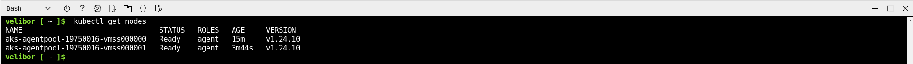

## Lab 09c - Implement Azure Kubernetes Service <br /> Student lab manual

### Lab scenario  
Contoso has a number of multi-tier applications that are not suitable to run by using Azure Container Instances. In order to determine whether they can be run as containerized workloads, you want to evaluate using Kubernetes as the container orchestrator. To further minimize management overhead, you want to test Azure Kubernetes Service, including its simplified deployment experience and scaling capabilities.

### Objectives  
In this lab, you will:
* Task 1: Register the Microsoft.Kubernetes and Microsoft.KubernetesConfiguration resource providers  
* Task 2: Deploy an Azure Kubernetes Service cluster  
* Task 3: Deploy pods into the Azure Kubernetes Service cluster  
* Task 4: Scale containerized workloads in the Azure Kubernetes service cluster  
* [Detailed explanation and actions required for each step](https://microsoftlearning.github.io/AZ-104-MicrosoftAzureAdministrator/Instructions/Labs/LAB_09c-Implement_Azure_Kubernetes_Service.html)  

#### Task 4: Scale containerized workloads in the Azure Kubernetes service cluster  
In this task, you will scale horizontally the number of pods and then number of cluster nodes.

1. From the Cloud Shell pane, and run the following to scale the deployment by increasing of the number of pods to 2:  
    
    ```shell
    kubectl scale --replicas=2 deployment/nginx-deployment
    ```  

    

2. From the Cloud Shell pane, run the following to verify the outcome of scaling the deployment:  
    
    ```shell
    kubectl get pods
    ```  

      

3. From the Cloud Shell pane, run the following to scale out the cluster by increasing the number of nodes to 2:  
    
    ```shell
    RESOURCE_GROUP='az104-09c-rg1'

    AKS_CLUSTER='az104-9c-aks1'

    az aks scale --resource-group $RESOURCE_GROUP --name $AKS_CLUSTER --node-count 2
    ```  

      

4. From the Cloud Shell pane, run the following to verify the outcome of scaling the cluster:  
    
    ```shell
    kubectl get nodes
    ```  

      

5. From the Cloud Shell pane, run the following to scale the deployment:  
    
    ```shell
    kubectl scale --replicas=10 deployment/nginx-deployment
    ```  

      

6. From the Cloud Shell pane, run the following to verify the outcome of scaling the deployment:  
    
    ```shell
    kubectl get pods
    ```  

      

7. From the Cloud Shell pane, run the following to review the pods distribution across cluster nodes:  
    
    ```shell
    kubectl get pod -o=custom-columns=NODE:.spec.nodeName,POD:.metadata.name
    ```  

      

8. From the Cloud Shell pane, run the following to delete the deployment:  
    
    ```shell
    kubectl delete deployment nginx-deployment
    ```  

      
