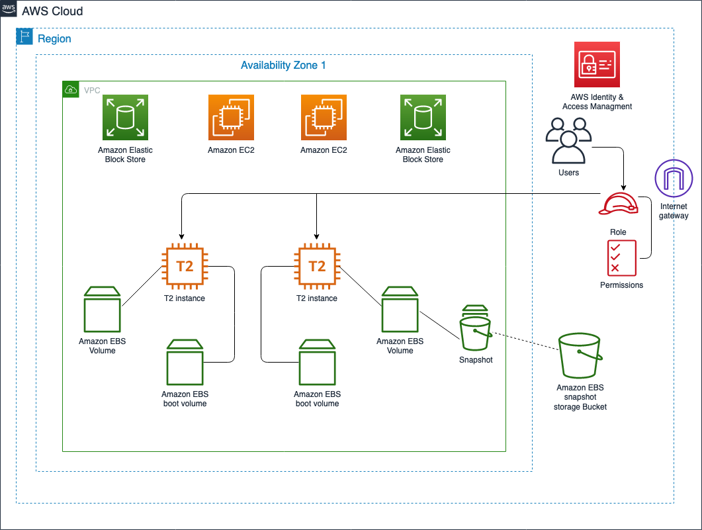
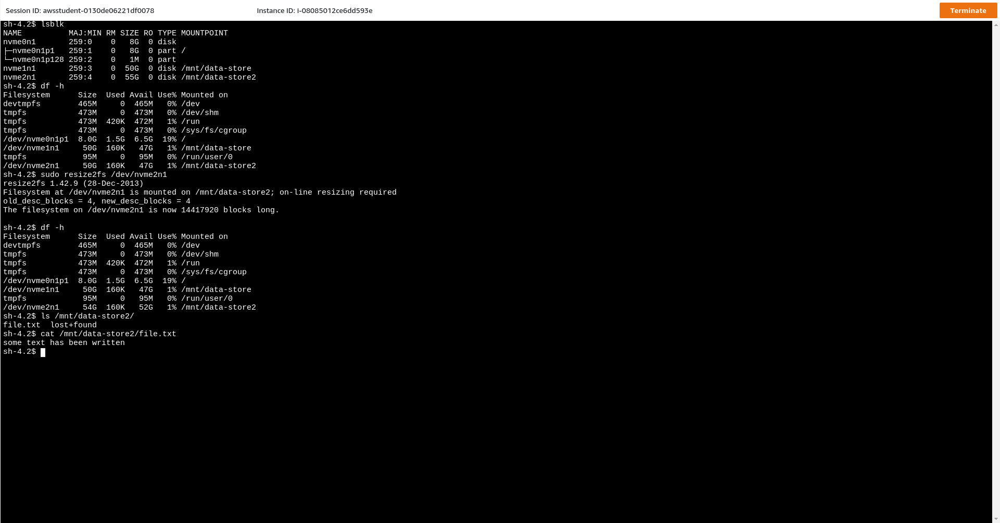

## Introduction to Amazon Elastic Block Store

### Lab overview
This lab introduces you to Amazon Elastic Block Store (Amazon EBS) using the AWS Management Console, explains the basic concepts of Amazon EBS in a step-by-step fashion and demonstrates how to create, attach EBS volumes to Amazon EC2 instances along with creating snapshots and restoring EBS volumes from snapshots.

### [Tasks 1 - 6](https://amazon.qwiklabs.com/focuses/55399?catalog_rank=%7B%22rank%22%3A2%2C%22num_filters%22%3A1%2C%22has_search%22%3Afalse%7D&parent=catalog)  

* Output from commands in Task 6:
  