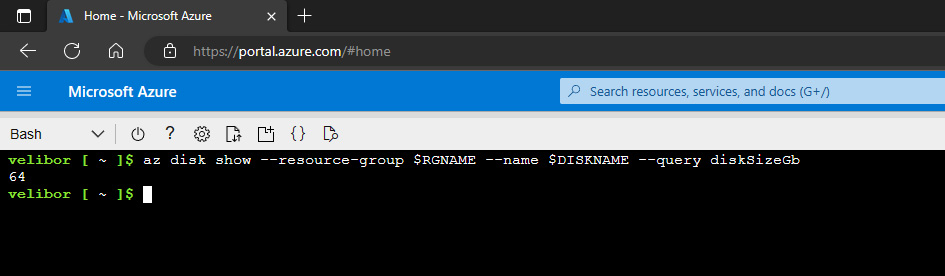
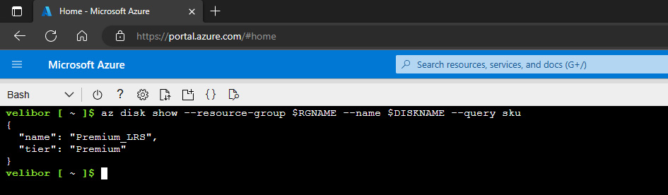

# Manage Azure resources by Using Azure CLI  
## Student lab manual

<br />

### Objectives
[Task1 and 2](https://microsoftlearning.github.io/AZ-104-MicrosoftAzureAdministrator/Instructions/Labs/LAB_03d-Manage_Azure_Resources_by_Using_Azure_CLI.html)  
Task 3: Configure the managed disk by using Azure CLI  

1. To increase the size of the Azure managed disk to 64 GB, from the Bash session within Cloud Shell, run the following:
```shell
az disk update --resource-group $RGNAME --name $DISKNAME --size-gb 64
```
2. To verify that the change took effect, run the following:  
```shell
az disk show --resource-group $RGNAME --name $DISKNAME --query diskSizeGb
```
  

3. To change the disk performance SKU to Premium_LRS, from the Bash session within Cloud Shell, run the following:  
```shell
az disk update --resource-group $RGNAME --name $DISKNAME --sku 'Premium_LRS'
```

4. To retrieve properties of the newly created disk, run the following:  
```shell
az disk show --resource-group $RGNAME --name $DISKNAME --query sku
```
