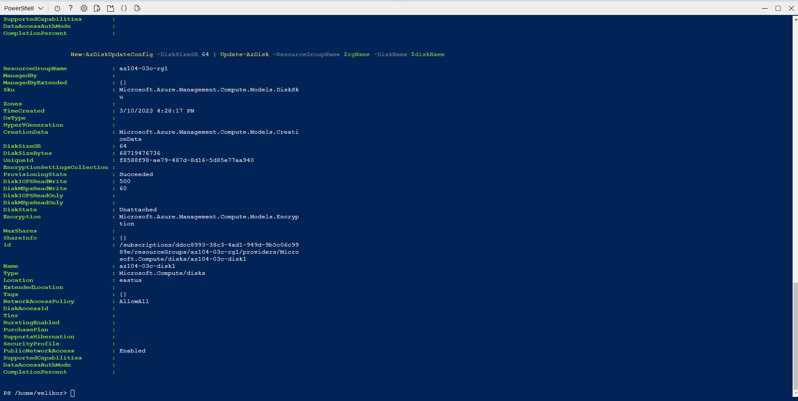
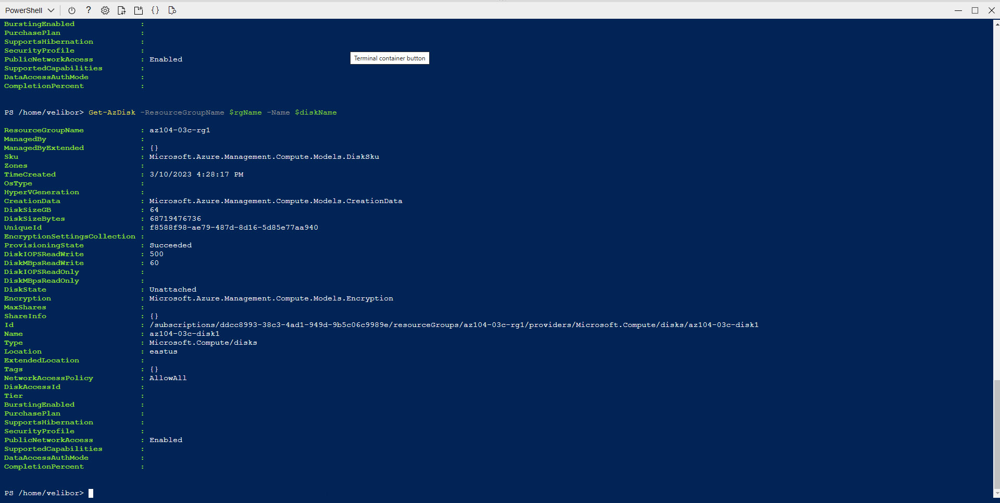
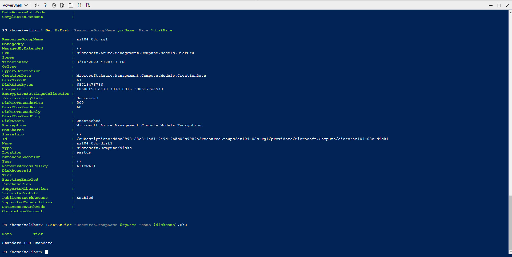
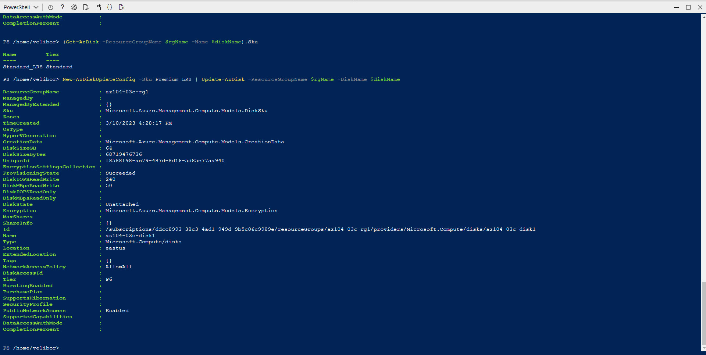
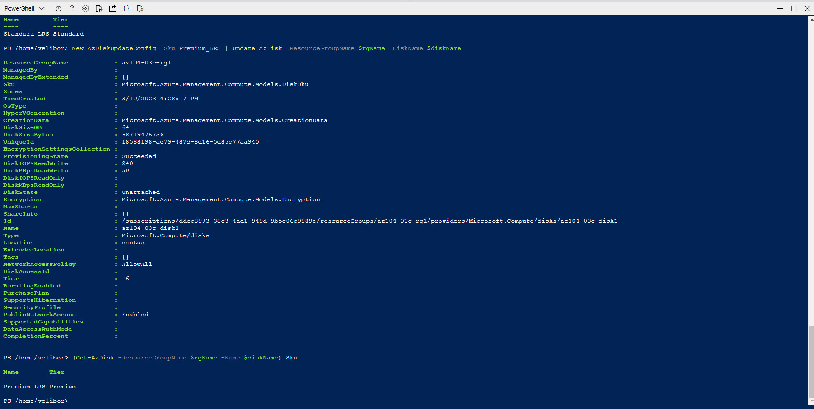

# Manage Azure resources by Using Azure PowerShell  
## Student lab manual

<br />

### Objectives
[Task1 and 2](https://microsoftlearning.github.io/AZ-104-MicrosoftAzureAdministrator/Instructions/Labs/LAB_03c-Manage_Azure_Resources_by_Using_Azure_PowerShell.html)  
Task 3: Configure the managed disk by using Azure PowerShell  

1. To increase the size of the Azure managed disk to 64 GB, from the PowerShell session within Cloud Shell, run the following:  
```powershell
New-AzDiskUpdateConfig -DiskSizeGB 64 | Update-AzDisk -ResourceGroupName $rgName -DiskName $diskName
```


2. To verify that the change took effect, run the following:  
```powershell
Get-AzDisk -ResourceGroupName $rgName -Name $diskName
```


3. To verify the current SKU as Standard_LRS, run the following:  
```powershell
(Get-AzDisk -ResourceGroupName $rgName -Name $diskName).Sku
```


4. To change the disk performance SKU to Premium_LRS, from the PowerShell session within Cloud Shell, run the following:  
```powershell
New-AzDiskUpdateConfig -Sku Premium_LRS | Update-AzDisk -ResourceGroupName $rgName -DiskName $diskName
```


5. To verify that the change took effect, run the following:
```powershell
(Get-AzDisk -ResourceGroupName $rgName -Name $diskName).Sku
```
