## Docker (Podman) Exercise

<br />

### Lab1: Docker basics
1. Log in to your VM.  
2. Start terminal and elevate your privileges to root.  
3. Run yum install docker.  
4. After installation is finished, start docker by running this command systemctl start docker.  
5. Also enable docker service automatic start with command systemctl enable docker.  
6. Run docker version to see installed version.  
   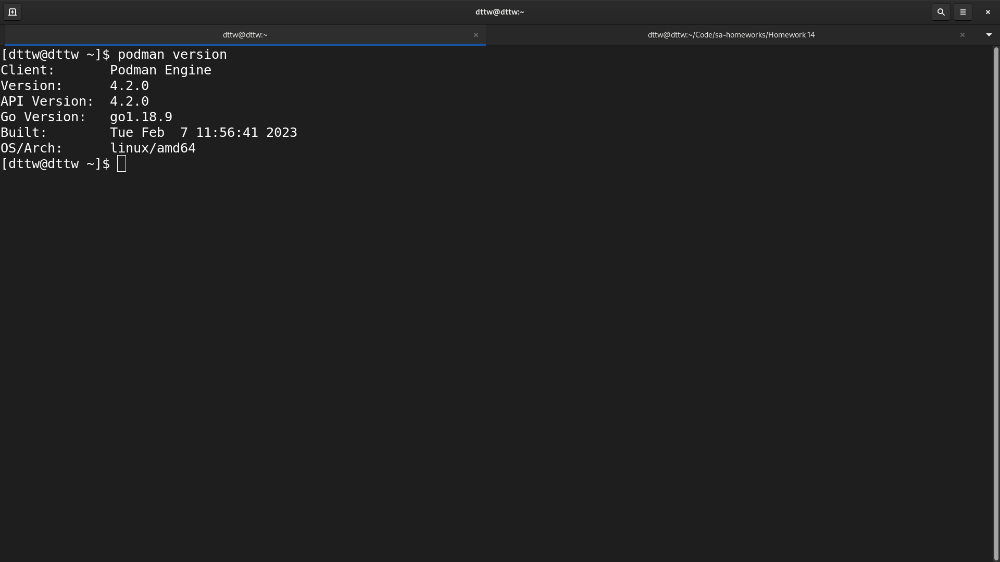  

7. Run docker help to see list of available commands.  
   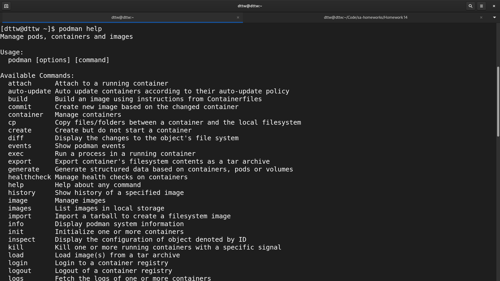

8. Search for a command (switch) that will show system-wide information for your instance of docker.
9. Test it by running docker command you have discovered.  
   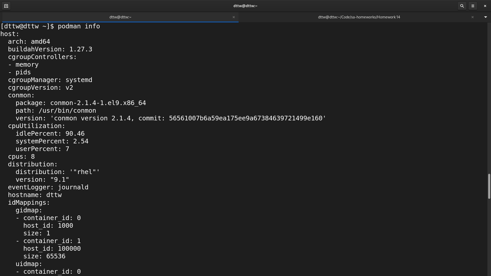  

10. From the output try to find where the information of number of containers and images is.  
11. Also try to find whether this docker is part of a swarm.  

### Lab2: Creating images  
1. Create a Docker container that executes a simple bash script. Go to your home directory and run mkdir test.
Run cd test.  
2. Create a simple script. Run vi test.sh.
3. Write the following in your script file:
  ```bash
    #!/bin/bash
    sleep 30
    exit 1
  ```  
  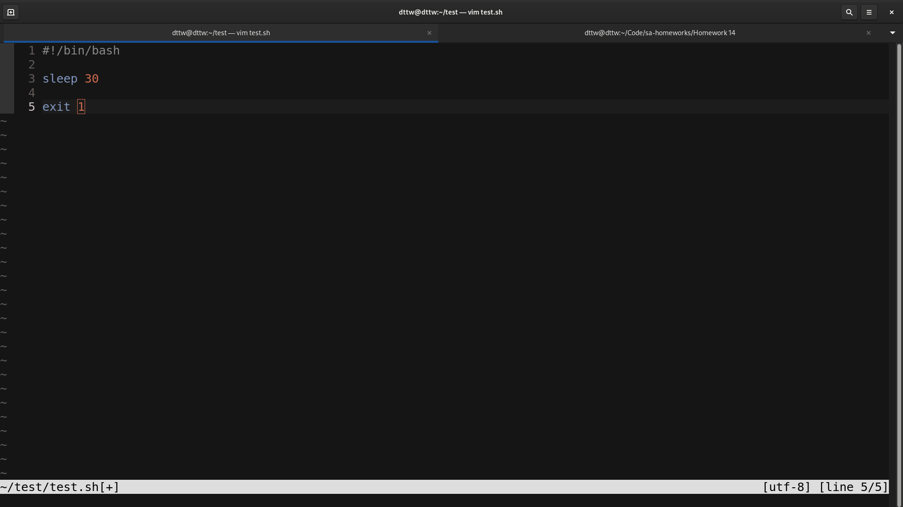  

4. Save the file. In vi editor press :wq.
5. Create a docker file. Run vi Dockerfile.
6. Write the following in our Dockerfile:
  ```Dockerfile
    FROM alpine
    ADD test.sh /
    CMD /bin/bash /test.sh
  ```
    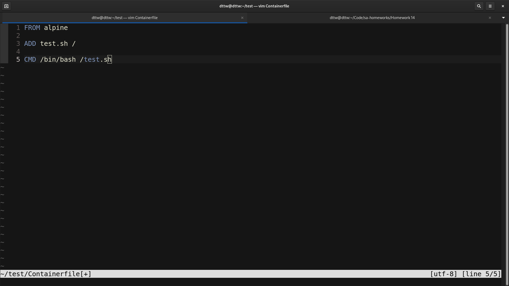

7. Save your Dockerfile.  
8. Build your image. Run docker build –t my-image1 ./  
  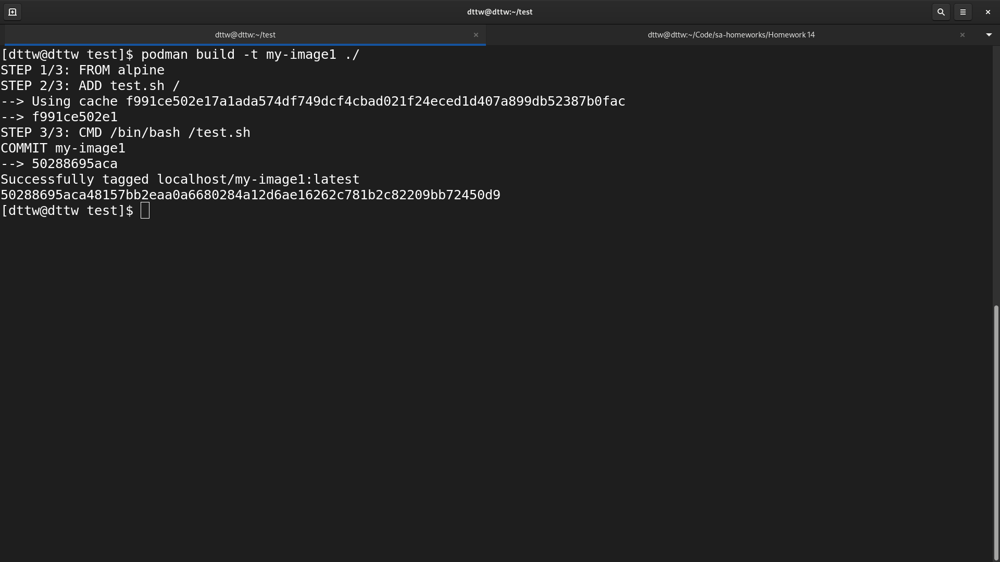

9. Now spawn a container. Run docker run - -name my-test1 my-image1.  
  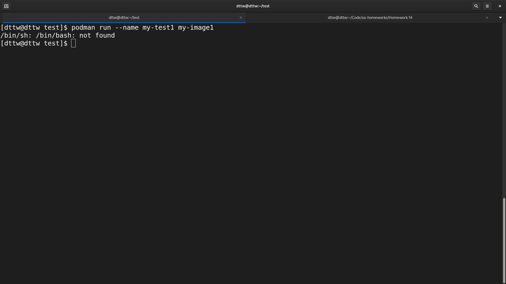

10. Do a docker ps –a. Do you see your container running?  
  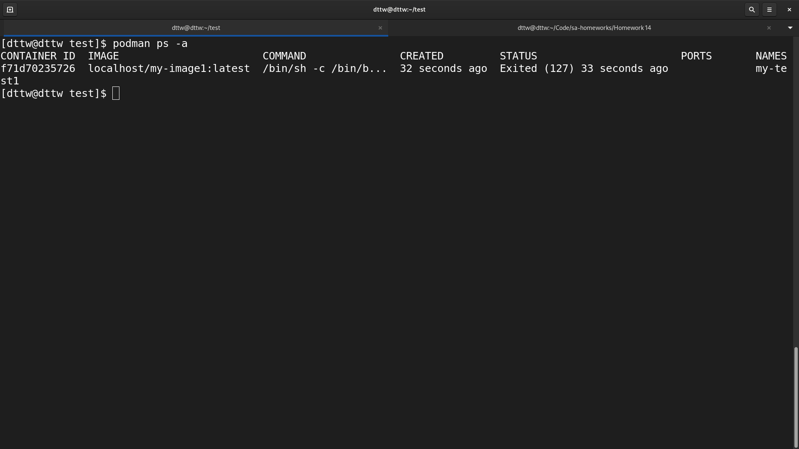

11. Do a docker logs my-test1. What is the output of the log?  
  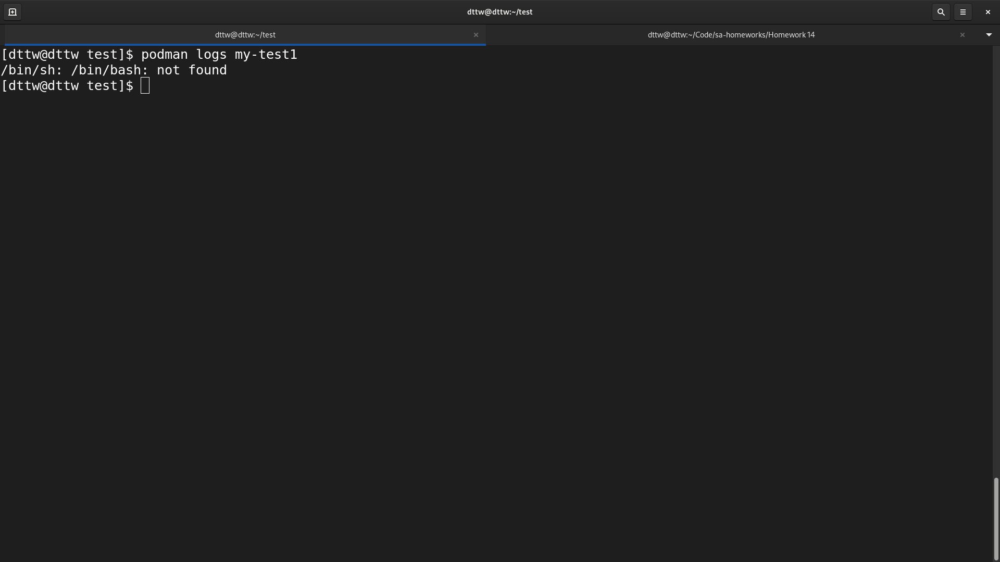

Note: Because alpine is very light Image it does not have bash binaries.  

12. Delete my-test. Run docker rm –f my-test1.  
13. Delete my–image. Run docker rmi –f my-image1.
    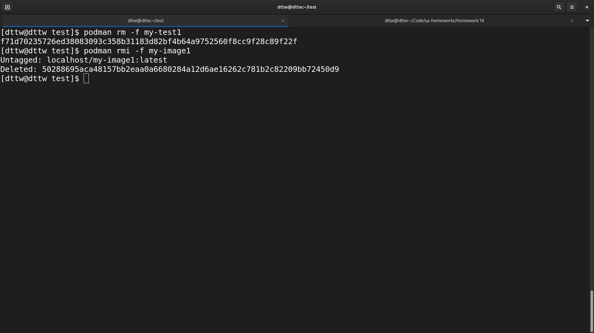

14. Build your image. Run docker build –t my-image1 ./  
    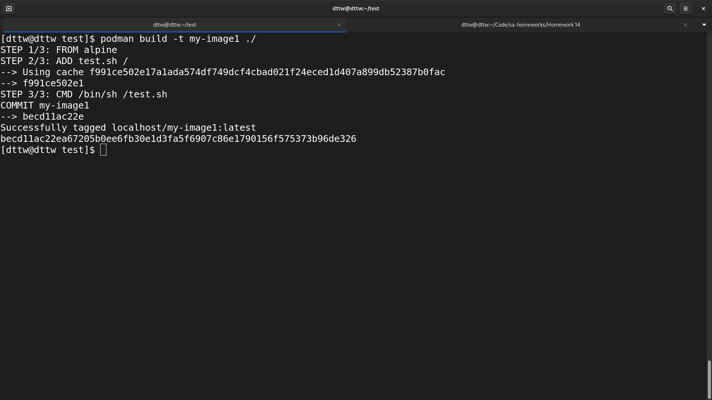  

15. Now spawn a container again. Run docker run - -name my-test1 my-image1.  
    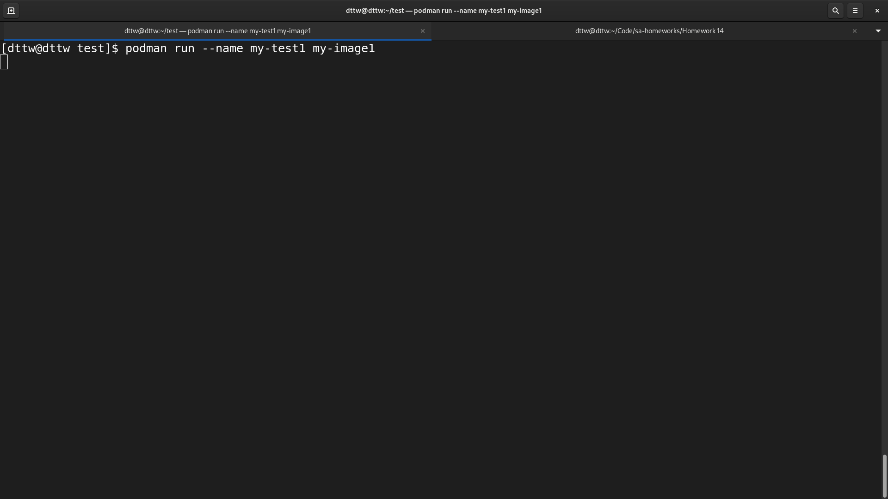  

16. Do a docker ps –a. Do you see your container running?  
17. Delete my-test. Run docker rm –f my-test1.  
18. Delete my–image. Run docker rmi –f my-image1.
    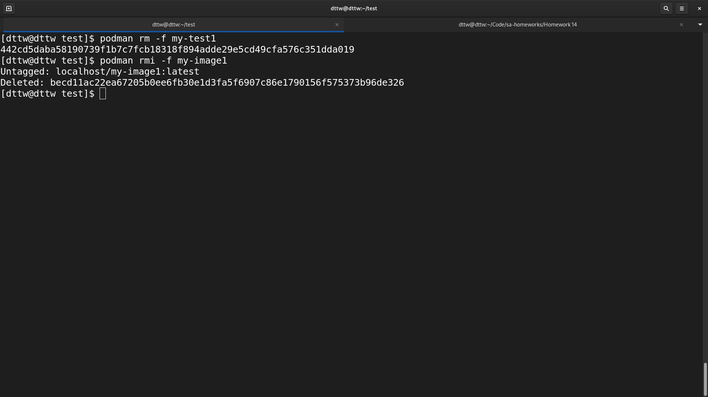