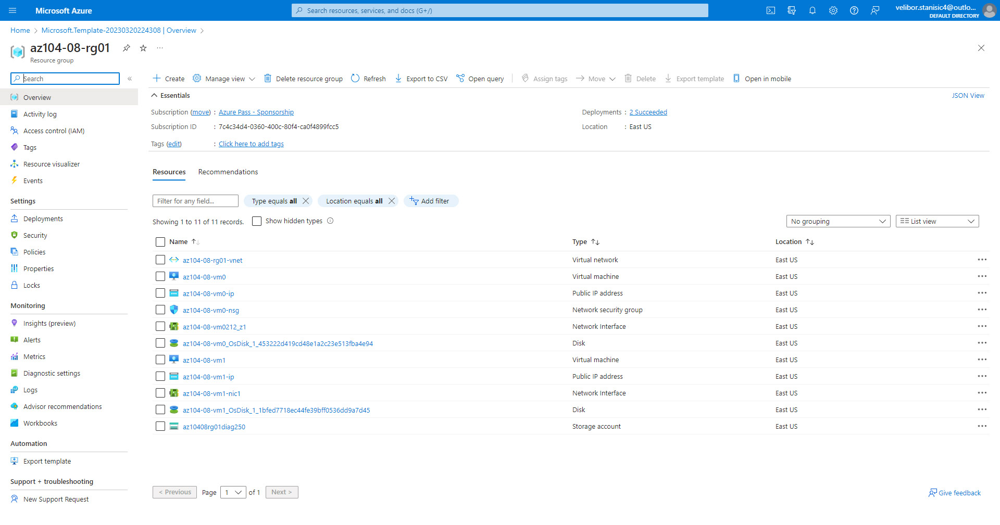
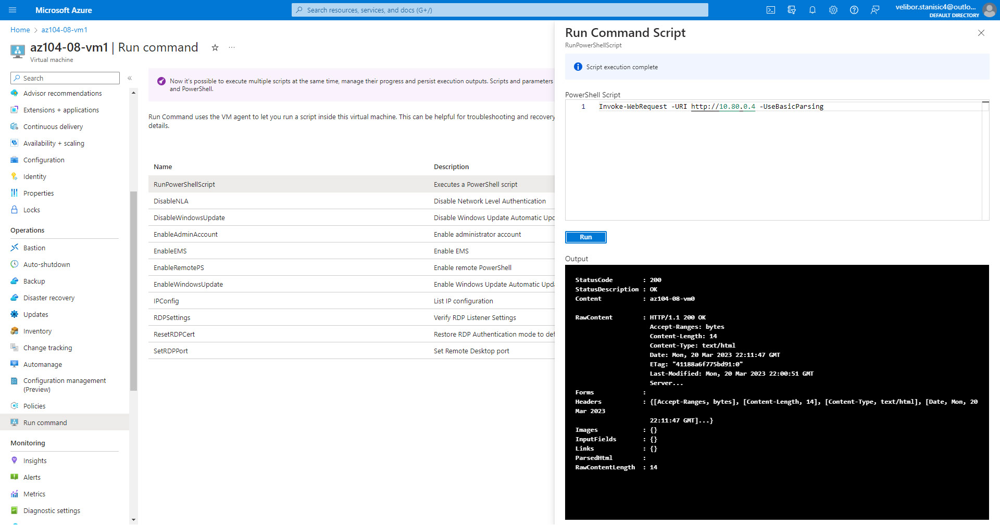
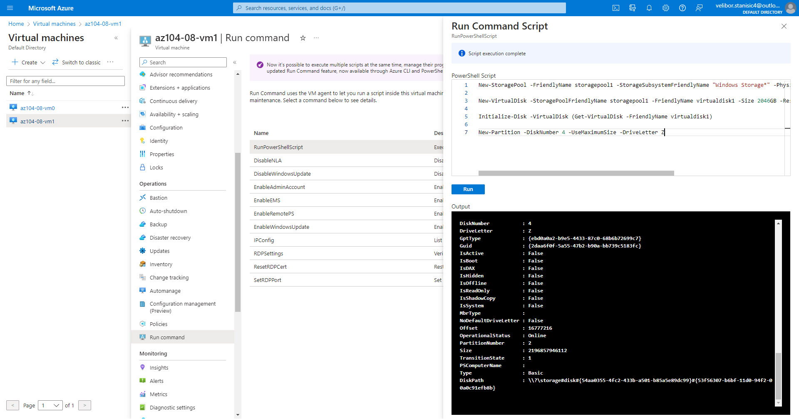
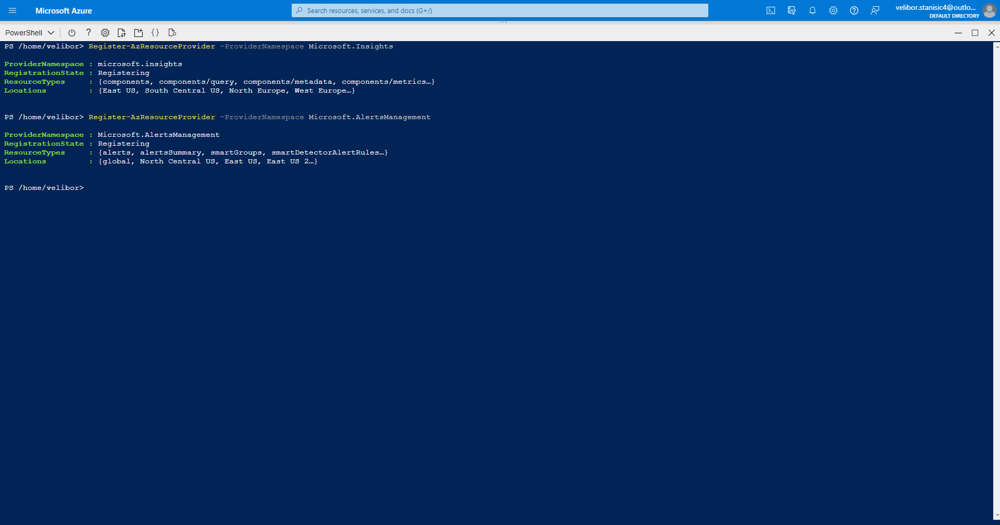
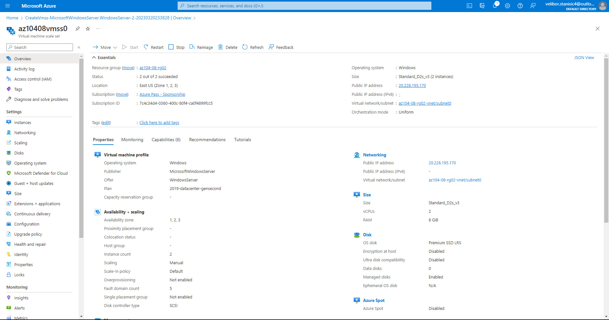
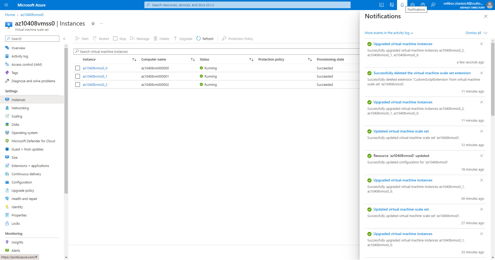

## Homework 10 - Lab 08 - Manage Virtual Machines  

 

### Lab scenario
You were tasked with identifying different options for deploying and configuring Azure virtual machines. First, you need to determine different compute and storage resiliency and scalability options you can implement when using Azure virtual machines. Next, you need to investigate compute and storage resiliency and scalability options that are available when using Azure virtual machine scale sets. You also want to explore the ability to automatically configure virtual machines and virtual machine scale sets by using the Azure Virtual Machine Custom Script extension.  

### Objectives  
In this lab, you will:

* Task 1: Deploy zone-resilient Azure virtual machines by using the Azure portal and an Azure Resource Manager template  
  

* Task 2: Configure Azure virtual machines by using virtual machine extensions
    

* Task 3: Scale compute and storage for Azure virtual machines  
    

* Task 4: Register the Microsoft.Insights and Microsoft.AlertsManagement resource providers  
    

* Task 5: Deploy zone-resilient Azure virtual machine scale sets by using the Azure portal  
    

* Task 6: Configure Azure virtual machine scale sets by using virtual machine extensions  
    

* Task 7: Scale compute and storage for Azure virtual machine scale sets (optional)  
  