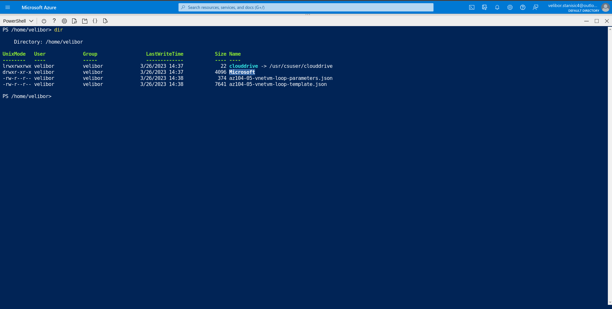
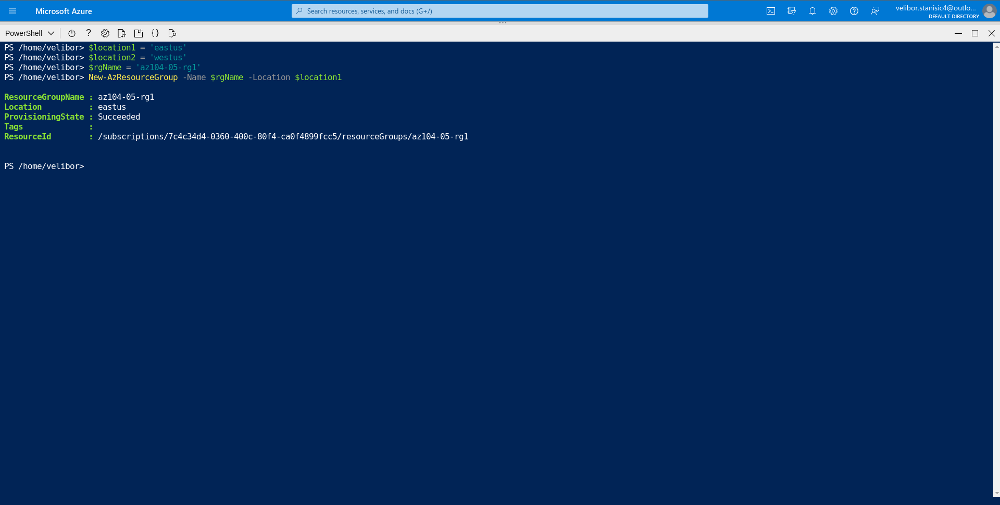
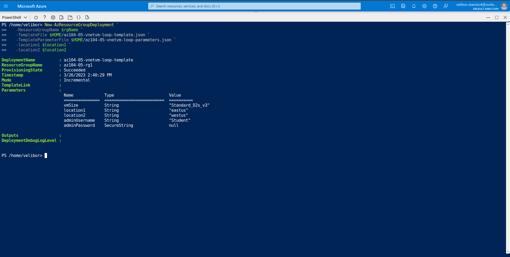
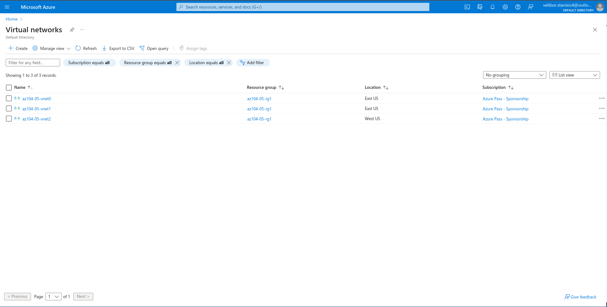
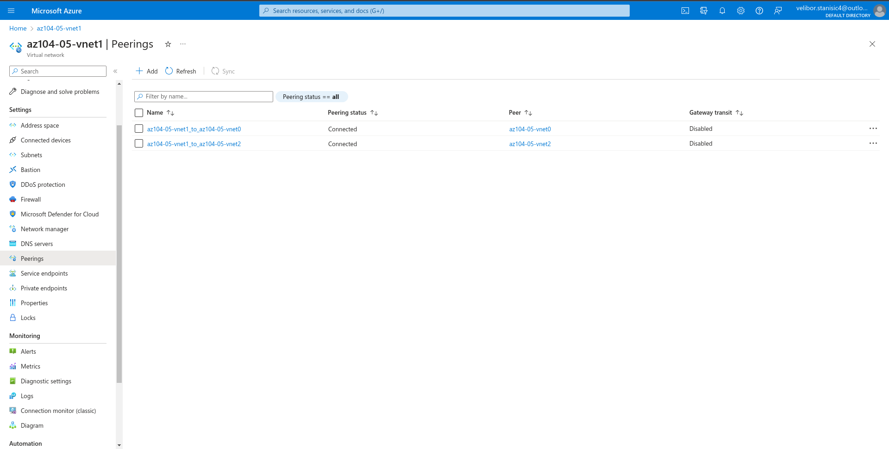
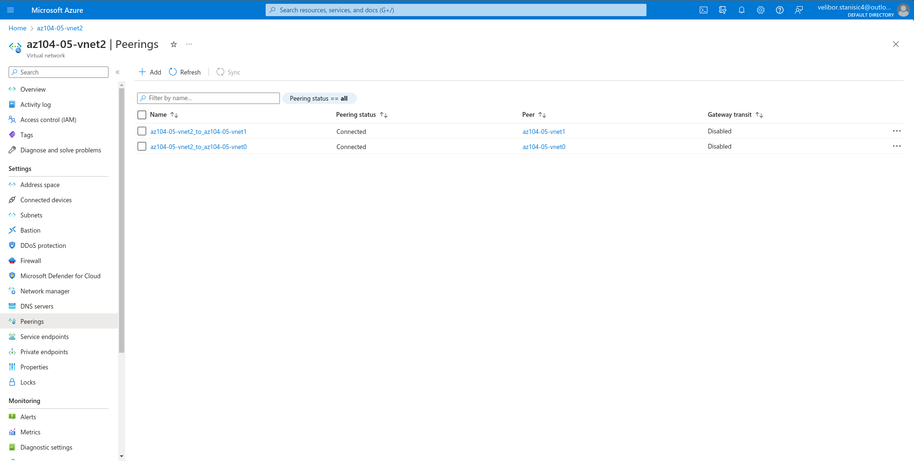
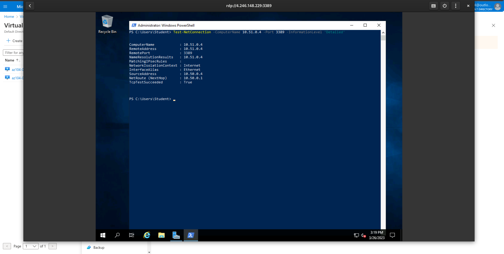
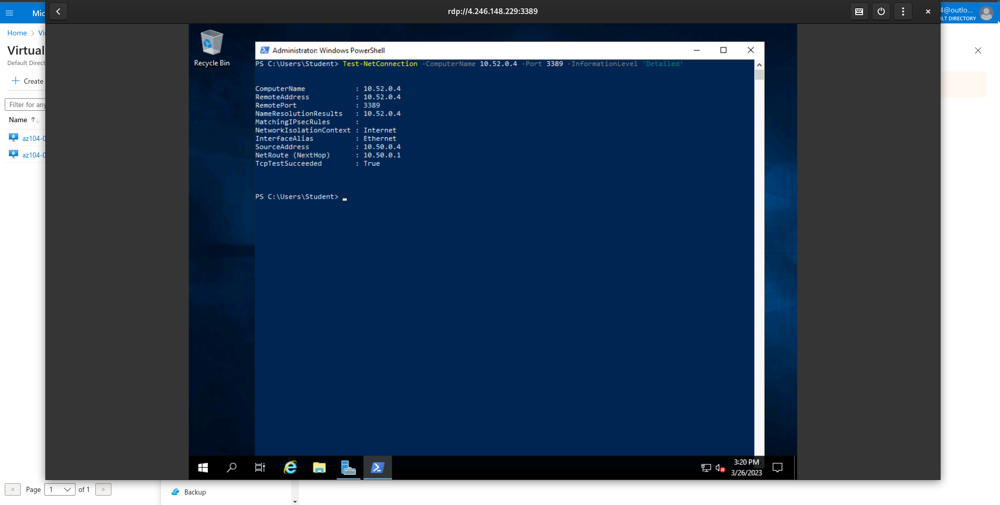
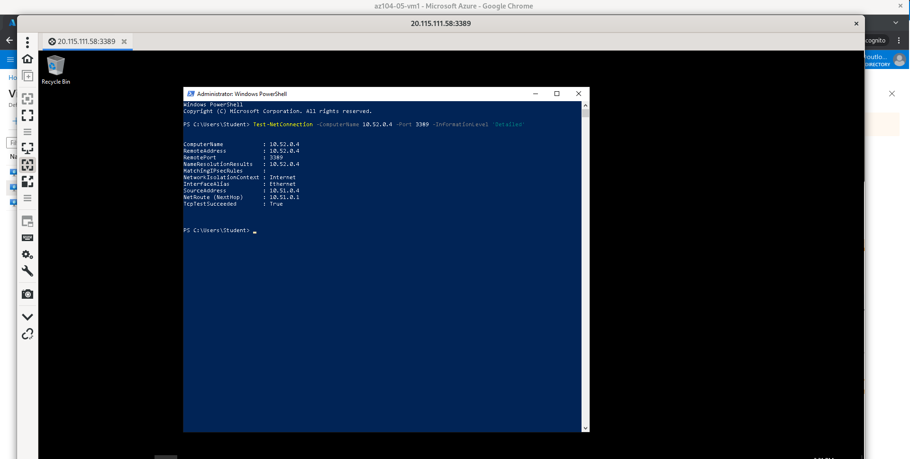

## Homework 12 - Lab 05 - Implement Intersite Connectivity  

<br />

### Lab scenario  
Contoso has its datacenters in Boston, New York, and Seattle offices connected via a mesh wide-area network links, with full connectivity between them. You need to implement a lab environment that will reflect the topology of the Contoso’s on-premises networks and verify its functionality.

### Objectives
In this lab, you will:

* Task 1: Provision the lab environment  
* Task 2: Configure local and global virtual network peering  
* Task 3: Test intersite connectivity  

### Architecture diagram


#### Task 1: Provision the lab environment  
In this task, you will deploy three virtual machines, each into a separate virtual network, with two of them in the same Azure region and the third one in another Azure region.  

4. In the toolbar of the Cloud Shell pane, click the Upload/Download files icon, in the drop-down menu, click Upload and upload the files \Allfiles\Labs\05\az104-05-vnetvm-loop-template.json and \Allfiles\Labs\05\az104-05-vnetvm-loop-parameters.json into the Cloud Shell home directory.


5. Edit the Parameters file you just uploaded and change the password. If you need help editing the file in the Shell please ask your instructor for assistance. As a best practice, secrets, like passwords, should be more securely stored in the Key Vault.

6. From the Cloud Shell pane, run the following to create the resource group that will be hosting the lab environment. The first two virtual networks and a pair of virtual machines will be deployed in [Azure_region_1]. The third virtual network and the third virtual machine will be deployed in the same resource group but another [Azure_region_2]. (replace the [Azure_region_1] and [Azure_region_2] placeholder, including the square brackets, with the names of two different Azure regions where you intend to deploy these Azure virtual machines. An example is $location1 = ‘eastus’. You can use Get-AzLocation to list all locations.):  
    ```powershell
    $location1 = 'eastus'

    $location2 = 'westus'

    $rgName = 'az104-05-rg1'

    New-AzResourceGroup -Name $rgName -Location $location1
    ```  
    

7. From the Cloud Shell pane, run the following to create the three virtual networks and deploy virtual machines into them by using the template and parameter files you uploaded:
  
    ```powershell
    New-AzResourceGroupDeployment `
   -ResourceGroupName $rgName `
   -TemplateFile $HOME/az104-05-vnetvm-loop-template.json `
   -TemplateParameterFile $HOME/az104-05-vnetvm-loop-parameters.json `
   -location1 $location1 `
   -location2 $location2
    ```  
    

#### Task 2: Configure local and global virtual network peering  
In this task, you will configure local and global peering between the virtual networks you deployed in the previous tasks.  

2. Review the virtual networks you created in the previous task and verify that the first two are located in the same Azure region and the third one in a different Azure region.  
  

3. In the list of virtual networks, click az104-05-vnet0.

4. On the az104-05-vnet0 virtual network blade, in the Settings section, click Peerings and then click + Add.  

5. Add a peering with the following settings (leave others with their default values) and click Add:  

6. On the az104-05-vnet0 virtual network blade, in the Settings section, click Peerings and then click + Add.  

7. Add a peering with the following settings (leave others with their default values) and click Add:  

8. Navigate back to the Virtual networks blade and, in the list of virtual networks, click az104-05-vnet1.  

9. On the az104-05-vnet1 virtual network blade, in the Settings section, click Peerings and then click + Add.  

10. Add a peering with the following settings (leave others with their default values) and click Add:  





#### Task 3: Test intersite connectivity
In this task, you will test connectivity between virtual machines on the three virtual networks that you connected via local and global peering in the previous task.

6. In the Windows PowerShell console window, run the following to test connectivity to az104-05-vm1 (which has the private IP address of 10.51.0.4) over TCP port 3389:
    ```powershell
    Test-NetConnection -ComputerName 10.51.0.4 -Port 3389 -InformationLevel 'Detailed'
    ```
7. Examine the output of the command and verify that the connection was successful.
    

8. In the Windows PowerShell console window, run the following to test connectivity to az104-05-vm2 (which has the private IP address of 10.52.0.4):
    ```powershell
    Test-NetConnection -ComputerName 10.52.0.4 -Port 3389 -InformationLevel 'Detailed'
    ```  
    

9. Switch back to the Azure portal on your lab computer and navigate back to the Virtual machines blade.

10. In the list of virtual machines, click az104-05-vm1.

11. On the az104-05-vm1 blade, click Connect, in the drop-down menu, click RDP, on the Connect with RDP blade, click Download RDP File and follow the prompts to start the Remote Desktop session.

12. When prompted, sign in by using the Student username and the password from your parameters file.

13. Within the Remote Desktop session to az104-05-vm1, right-click the Start button and, in the right-click menu, click Windows PowerShell (Admin).

14. In the Windows PowerShell console window, run the following to test connectivity to az104-05-vm2 (which has the private IP address of 10.52.0.4) over TCP port 3389:  
    ```powershell
    Test-NetConnection -ComputerName 10.52.0.4 -Port 3389 -InformationLevel 'Detailed'
    ```

15. Examine the output of the command and verify that the connection was successful.
    


### Review
In this lab, you have:

* Provisioned the lab environment
* Configured local and global virtual network peering
* Tested intersite connectivity