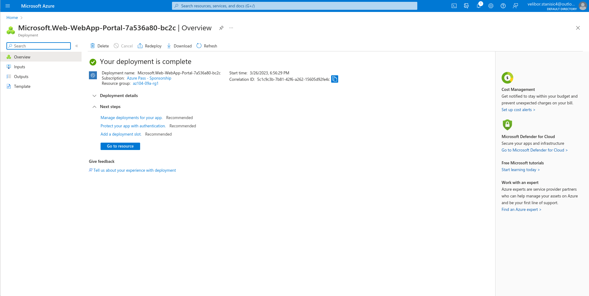
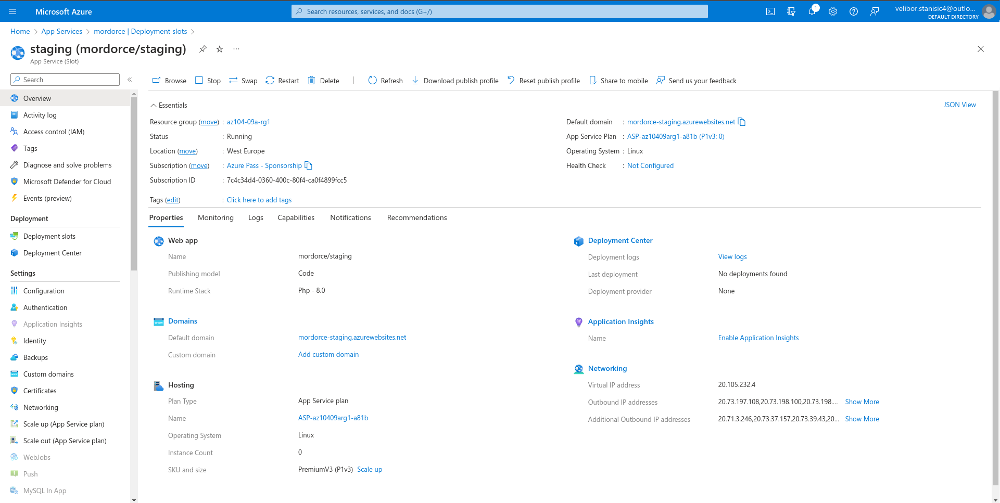
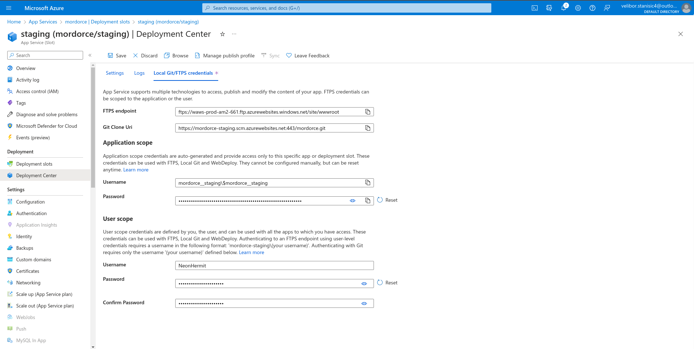
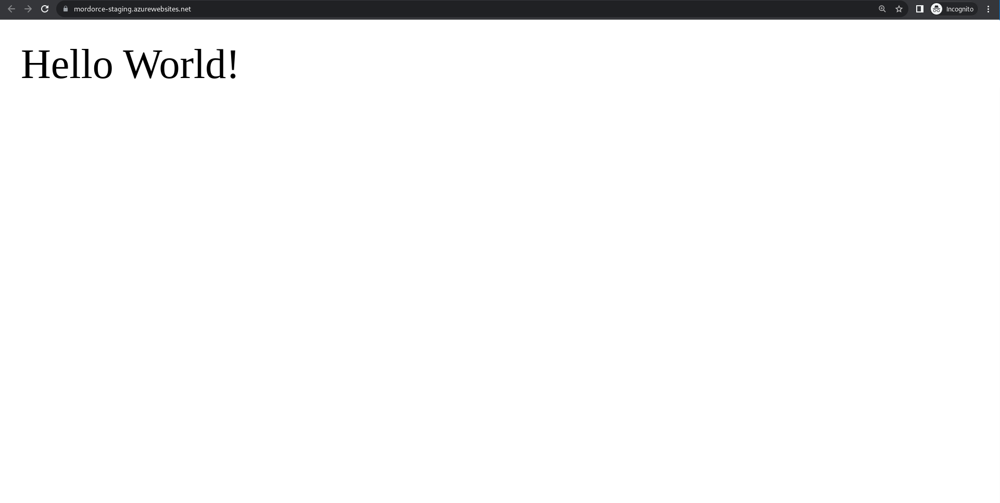
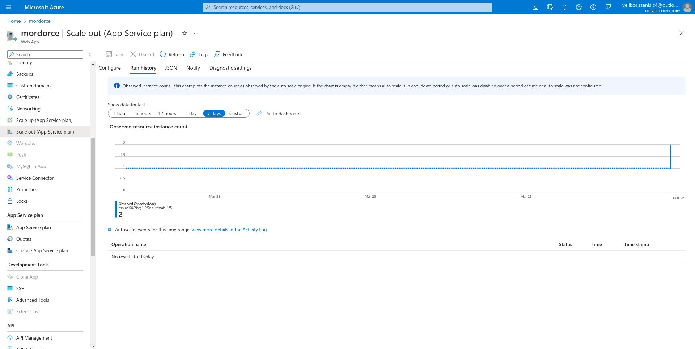

## Homework 13 - Lab 09a - Implement Web Apps  

 

### Lab scenario  
You need to evaluate the use of Azure Web apps for hosting Contoso’s web sites, hosted currently in the company’s on-premises data centers. The web sites are running on Windows servers using PHP runtime stack. You also need to determine how you can implement DevOps practices by leveraging Azure web apps deployment slots.  

### Objectives
In this lab, you will:

* Task 1: Create an Azure web app
* Task 2: Create a staging deployment slot
* Task 3: Configure web app deployment settings
* Task 4: Deploy code to the staging deployment slot
* Task 5: Swap the staging slots
* Task 6: Configure and test autoscaling of the Azure web app

### Architecture diagram

#### Task 1: Create an Azure web app

#### Task 2: Create a staging deployment slot

#### Task 3: Configure web app deployment settings

#### Task 4: Deploy code to the staging deployment slot

#### Task 5: Swap the staging slots

#### Configure and test autoscaling of the Azure web app

### Review
In this lab, you have:

* Created an Azure web app
* Created a staging deployment slot
* Configured web app deployment settings
* Deployed code to the staging deployment slot
* Swapped the staging slots
* Configured and test autoscaling of the Azure web app