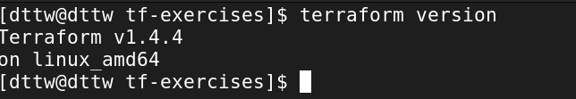

## Homework 16 - Terraform basic exercises  

#### Task 1: Install terraform and Azure CLI  
1. Use official guidelines to install the latest version of terraform and Azure CLI  

2. Authenticate with Azure CLI  

3. Set the exercise subscription as default for Azure CLI  

4. Provide console print screen:  
    4.1 Time and date when the exercise was worked  
    

    4.2 Output of the terraform command that will print out the Terraform version installed  
    
    
    4.3 Azure CLI output of the current subscription  
    

#### Task 2: Define your first terraform infrastructure code  
1. Add minimal provider configuration and initialize terraform  
    1.1 Create file called "main.tf"  

    1.2 Inside the file add the minimal configuration needed which is provided on terraform registry site for the Azure Provider (azurerm) following the instructions from the USE PROVIDER link near the top right corner of the page. (Every provider in terraform registry has instruction on how to use the provider, the configuration Arguments, along with some examples).  
    
    1.3 Save the file  
    
    1.4 Initialize terraform. The output of the command should not show any errors.  
    
    1.5 Execute terraform plan of the current terraform code. The output should not show any errors and will say that there are no changes (this is expected since we still don’t have any infrastructure resources defined)  
    
    1.6 Beneath the block for the provider add the following code block  

    ```tf
    data "azurerm_subscription" "current" {}
    ```
    
    1.7 Execute terraform plan once again. This time it will throw you an error.  
    
    1.7.1 Read the content of the error and see what you are missing.  
    
    1.7.2 Go back to the azurerm terraform registry page and see the Example Usage code block.  
    
    1.7.3 Compare the problematic block with the one in the example.  
    
    1.7.4 Scroll down to Argument reference part of the page and see the required arguments for the provider block. (The Argument reference part of the provider or resource description gives us information about the arguments that we can configure on one provider or resource and most importantly the mandatory ones marked as Required)  
    
    1.8 Make the corrections and execute another terraform plan command. This time you should not
    see any errors and changes.

2. Usage of static provider version  
    
    2.1 Currently our version of azurerm provider is set to fixed value, which is not always a good practice because we rarely think about upgrading the provider version in normal work.  
    
    2.2 Set the azurerm provider to version 3.35.0  
    
    2.3 Add the code block bellow to your code:  

    ```tf
    resource "random_string" "random" {
      length  = 8
      special = false
      lower   = true
      upper   = false
    }

    resource "azurerm_resource_group" "example" {
      name     = "${random_string.random.result}-rg"
      location = "West Europe"
    }

    resource "azurerm_storage_account" "example" {
      name                     = "${random_string.random.result}sa"
      resource_group_name      = azurerm_resource_group.example.name
      location                 = azurerm_resource_group.example.location
      account_tier             = "Standard"
      account_replication_type = "GRS"

      blob_properties {
        restore_policy {
          days = 7
        }
      }

      tags = {
        environment = "staging"
      }
    }
    ```  

    2.4 Let’s see the plan of our code  

    2.4.1 Execute terraform plan.  
    
    2.4.2 Now we have problem that terraform is initialized with different provider version and we must reinitialize with “upgrade” terraform to get the assigned version.  
    
        • Execute terraform init –upgrade command to accomplish that. 
        (This is required whenever we work with already initialized terraform working directory.)
    
    2.4.3 Since we have reinitialized and updated our working directory, we can proceed again with the terraform plan command.  
    
    2.4.4 Now the output gives us another error which says that the block ‘restore_policy’ is not expected in our “azurem_storage_account” resource. But why is that?  
    
        • Go to the terraform registry and read the provided documentation 
        for the “azurem_storage_account” resource. Check the blob 
        properties block and check if it has description for field named 
        restore_policy.  
        
        • The field is present, then why do we have the issue?  
          o When we browse terraform registry we are always forwarded to 
          the latest version of the provider. What version of the provider 
          do we have? Isn’t it 3.35.0.  
          o Let’s see the documentation for version 3.35.0 of azurerm 
          provider for the “azurem_storage_account” resource. Check the 
          blob properties block and check if it has description for field 
          named restore_policy.  

        • The field is not present in version 3.35.0 and this is causing 
        our problem. The change for the restore_policy on the 
        blob_properties is introduced in version 3.36 of the azurerm 
        provider and we have set fixed version of 3.35.0 for the provider.

        • In order to fix this we would need to allow our terraform code to
        be able to automatically upgrade to the latest version of the 
        provider by default. But, at the same time we would need to setup 
        the minimum allowed version for which our code works, and that 
        is 3.36.0  
    
    2.5 Allow automatic updating of azurerm provider to the latest version, but with minimum version of 3.36.0  

    2.5.1 Go to your provider configuration and replace the current version with “>= 3.36.0” (allow azurerm version that is greater or equal to 3.36.0)  
  
    2.6 Check the result of terraform plan now. Don’t forget to reinitialize with upgrade.  
  
    2.6.1 Again, we have issues with our code?  

        • Well in the latest provider documentation for “azurem_storage_account” for the restore policy it says that must 
        be used together with delete_retention_policy set, 
        versioning_enabled and change_feed_enabled set to true. 
        This is the reason why we must consult terraform registry 
        constantly and read the documentation for the resource 
        configuration more carefully.  

    2.6.2 Add the following code bellow the restore_policy block:

    ```tf
    delete_retention_policy {
      days = 8
    }
    versioning_enabled  = true
    change_feed_enabled = true
    ```

    2.7 Check the results from your terraform plan now. There should be no issues and it will show what it will manage. Take the time to answer the following questions:

    2.7.1 How many resources have you defined in your code and how many resources does the plan output show? Are they the same and why?  
    **A: 3 resources: random_string, azurerm_resource_group, azurerm_storage_account. The number of resources in the file and plan output are the same because the plan reflects the changes Terraform will make based on our configuration.**

    2.7.2 What is the location of your resource group and what is the location of the storage account?  
    **A: West Europe.**

    2.8 Deploy your code to on the subscription and answer the questions bellow:  
    
    2.8.1 How many resources do you have on your subscription? (To list all resources, type “All resources” in the search bar on the top in Azure Portal)  
    2.8.2 Are the number of resources shown in the All resources portal window the same with the ones from your plan?  
    **A: It show's only the storage account.**
    
    2.8.3 Give short explanation about the resources that are not shown?  
    **A: random string resource cannot be found in the Azure portal. It generates random string.**

    2.8.4 Provide print screen of your portal with all resources.  
    

**IMPORTANT!!! Make sure you have the correct subscription selected if you already have
multiple.**  

#### Task 3: Using variables and outputs  
1. Using input variable  

    1.1. While you’re in the same directory from the previous task, create a file named variables.tf  
     
    1.2. Define the variable from the code bellow in the variables.tf file.  

    ```tf
    variable "my_name" {
      type = string
      description = "First name of the student"
    }
    ```

    1.3. Reference the input variable value in your code in the beginning of the name of the resource group  

    ```tf
    resource "azurerm_resource_group" "example" {
      name = "${var.my_name}-${random_string.random.result}-rg"
      location = "West Europe"
    }
    ```

    1.4. Define another variable of type string named “location” with default value of “West Europe” and description “The location where all resources will be placed.”. Use the definition of step 1.2 as reference and search in terraform documentation for defining a default value in a variable.  

    1.5. Reference the location variable as the location for the azurerm_resource_group resource. Use the example in step 1.2 of referencing the value but this time without the use of interpolation.  
    
    1.6. Execute terraform plan.  
    
    1.6.1. You are seeing that the code is asking you to insert an input value. Type your first name in lowercase and press enter.  
    
    1.6.2. Please answer the following questions:  

        • How many variables do we have defined, and which are they?  
          A: 2 variables, my_name and location

        • Why did terraform asked us to input a value only for the 
          my_name variable?  
          A: Because we didn't have defined value for my_name  


    1.7. Define input variable value in file  

    1.7.1. To allow automation we would need to have the non secret variables defined in a tfvars file named “inputs.tfvars” that you will create.  

    1.7.2. Define the value of the my_name variable inside the inputs.tfvars file like bellow:  

    ```tf
    my_name = "name"
    ```
    1.7.3. Execute terraform plan command with the option –var-file=inputs.tfvars  

    1.7.4. The plan should try to destroy 2 resources and create 2 resources.  

2. Using local values  

    2.1. In main.tf before the data block create locals block where we will define a local value named resource_prefix where we will concatenate the input variable my_name with the generated value from the random string resource like shown below:  

    ```tf
    locals {
      resource_prefix = "${var.my_name}${random_string.random.result}"
    }
    ```

    2.2. Add this resource_prefix as prefix of the name of the azurerm_resource_group and azurerm_storage_account resources. (This is very useful for standardizing and differentiating resources when deployed on portal.) Here is an example for the resources group and you should apply the same concept for the storage account.  

    ```tf
    resource "azurerm_resource_group" "example" {
      name = "${local.resource_prefix}-rg"
      location = var.location
    }
    ```

    2.3. Execute the terraform plan with the input variable file switch. It should show you again 2 resources for destroy and 2 resources to create.  

3. Using output values  

    3.1. To display some values from our resources we need to define the output values. For better visibility create an output.tf file where we will place all output values that we want to display after applying.  

    3.2. Inside the outputs.tf file define an output value named resource_group_name with the value of the name of the resource group that we create, like shown below  

    ```tf
    output "resource_group_name" {
      value = azurerm_resource_group.example.name
      description = "The name of the resource group we deployed"
    }
    ```

    3.3. Do the same for the output value named storage_account_name where the value will be the name of the storage account by using the example from step 3.2  

    3.4. Execute the terraform plan with the input variable file switch. It should show you again 2 resources for destroy and 2 resources to create. You will also see at the bottom that there will be outputs.  

4. Understanding the reason why our resources are being destroyed  

    4.1. When you execute terraform plan it will give you information about the resources and parameters that are being created with “+”, destroyed and recreated with “-/+”, the ones destroyed with “–“ and the ones that will be modified with “~”.  

    4.2. In this task we will need to go over our terraform plan and identify the reasons why our resources are being replaced.  
    4.2.1. Search for the term “forces replacement” and node the resource name and the parameter 
    that forces replacement. Describe the reason behind it  
    **A: Forces replacement means that a resource must be destroyed and recreated instead of being modified.**

5. Apply the terraform code and write down the outputs  

      

    