## Homework 19 - Jenkins  

#### Project Description  
Create a simple Jenkins pipeline for a private Github repo and Dockerhub to build an image for a GLTF viewer web app for animated 3D models.  

* Step 1: Generated access tokens from Github and Dockerhub and created credentials for the accounts in Jenkins settings
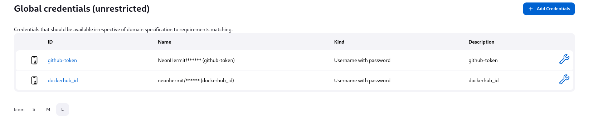  

* Step 2: Installed Jenkins Docker plugins  

* Step 3: Initial Jenkins pipeline configuration  
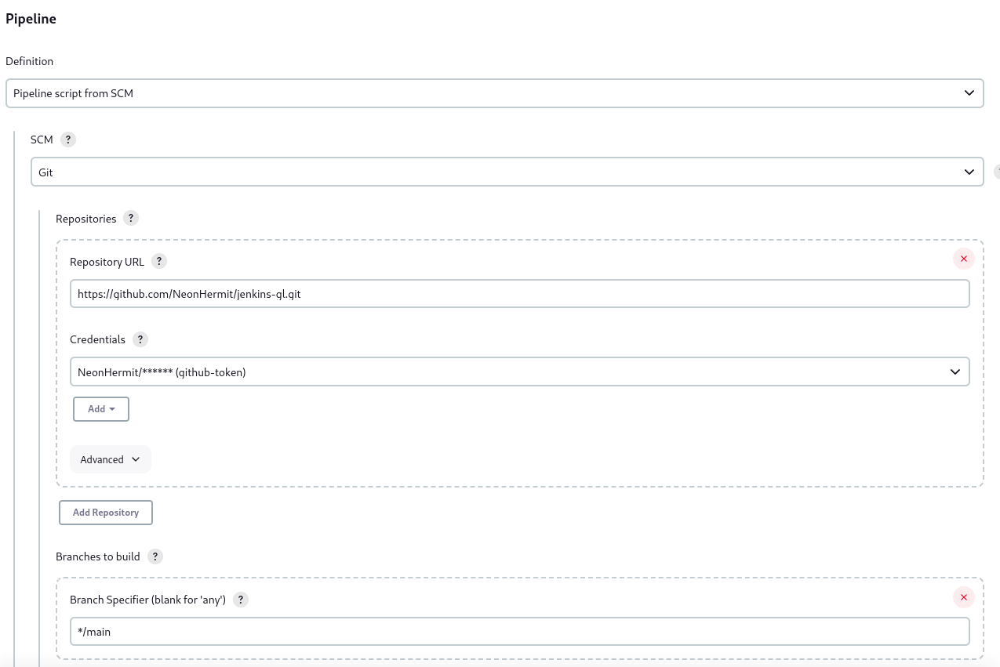  

* Step 4: Pushed the code to github  
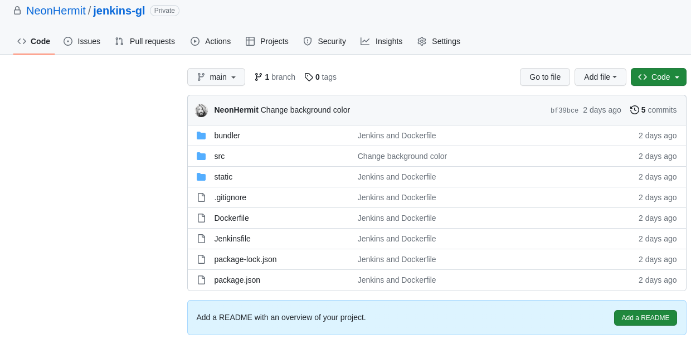  

  **Project structure:**  
  * Bundler: Webpack config for the dev and prod versions of the application. For the sake of simplicity in this exercise we are only building the dev version and pushing that to Docker.  
  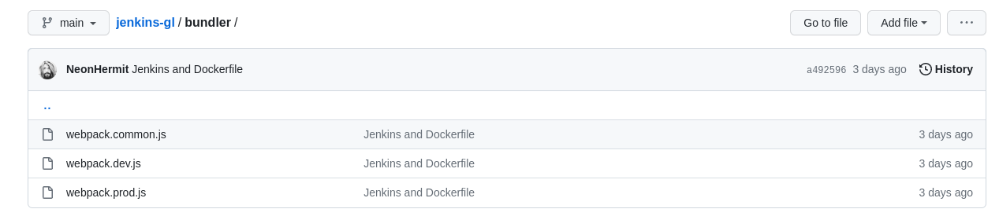  

  * Src: Contains the application code 
  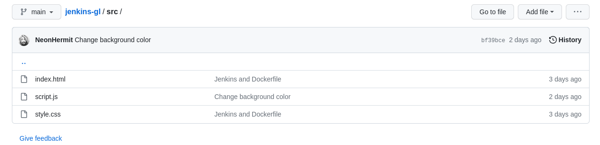  

  * Static: Contains the model, scene and textures  
  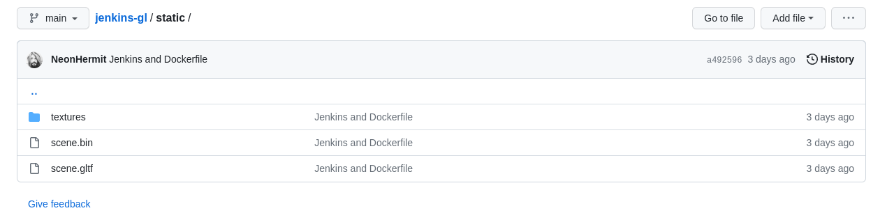  

  * Dockerfile

  * Jenkinsfile  
    ```Jenkinsfile
    pipeline {
      agent any
      options {
        buildDiscarder(logRotator(numToKeepStr: '5'))
      }
      environment {
        registry = "neonhermit/gltf-anim"
        dockerImage = ''
        DOCKERHUB_CREDENTIALS = credentials('dockerhub_id')
      }
      stages {
        stage('Build image') {
          steps {
            script {
              dockerImage = docker.build("${registry}:${BUILD_NUMBER}")
            }
          }
        }
        stage('Push image') {
          steps {
            script {
              docker.withRegistry('https://registry-1.docker.io', 'dockerhub_id') {
                dockerImage.push()
              }
            }
          }
        }
      }
      post {
        always {
          sh 'docker logout'
        }
      }
    }
    ```

* Step 5: Build Now from Jenkins  
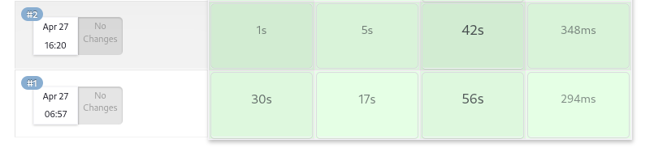  

  After pressing the Build now button we can see that our project is built successfully.  
  * Since we specified in the Jenkinsfile to discard old builds if we go to the Jenkins pipeline configuration for the project we can see that the Discard old builds is now checked and we have a Strategy and number of builds to keep.
  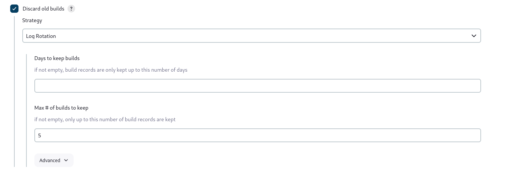   

  * Running the image  
  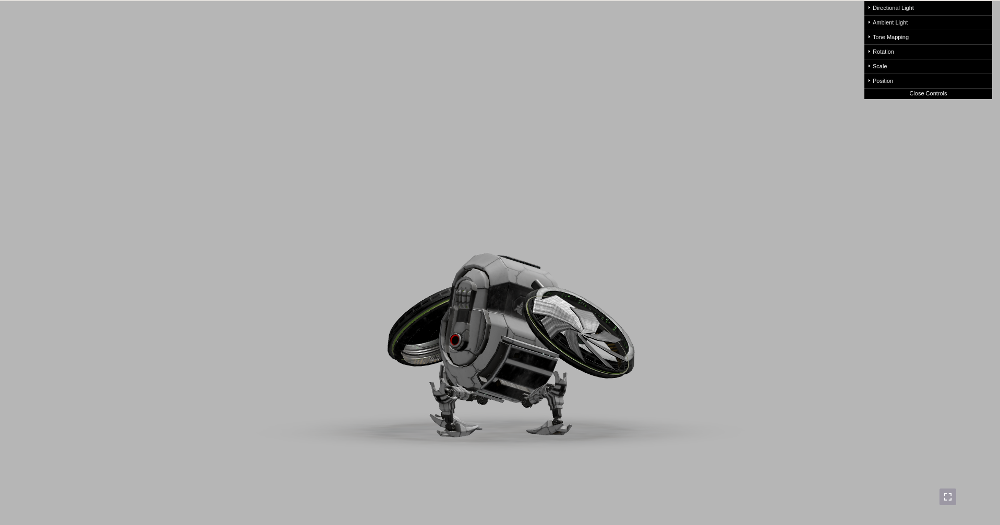  

* Step 6: Install *ngrock*,  
in the Jenkins configuration for the pipeline we check BuildTriggers -> Github hook trigger  
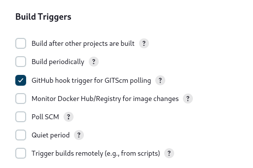  

  and in the github repo we go to settings -> webhooks, adding a webhook to trigger only on push event.  
  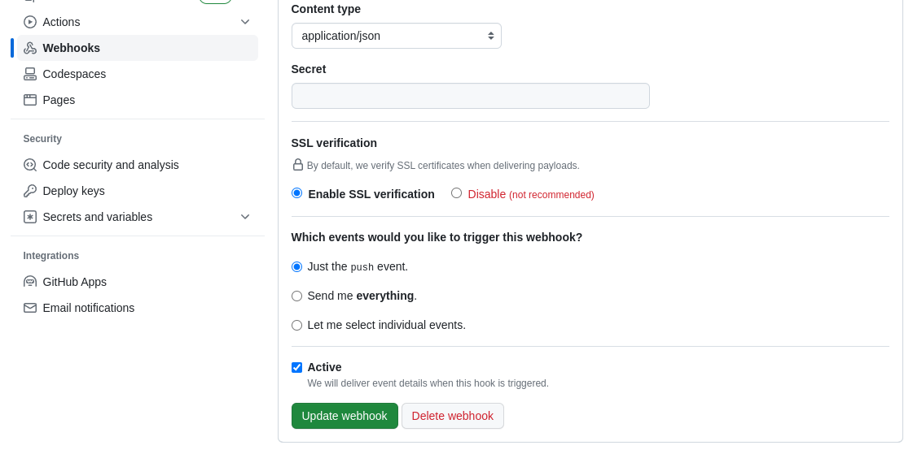

* Step 7: Modified the code to not have a scene background color, and pushed that to the github repo.  
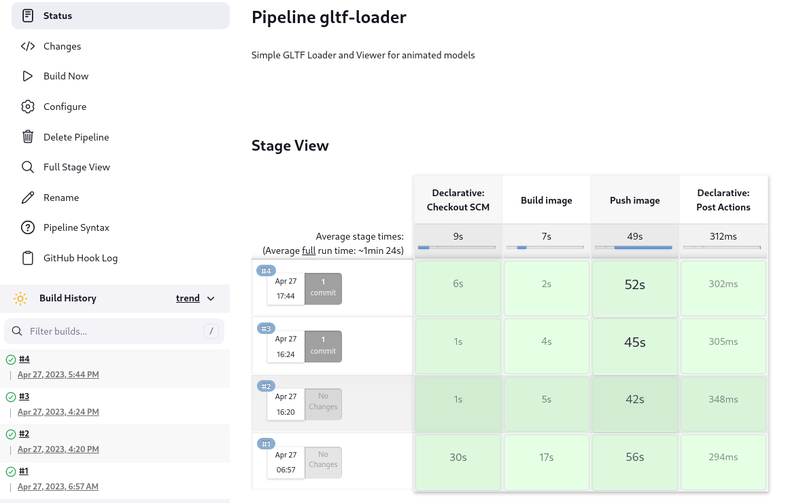  
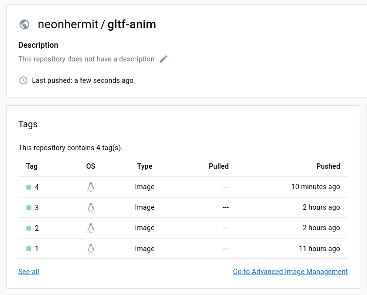  
