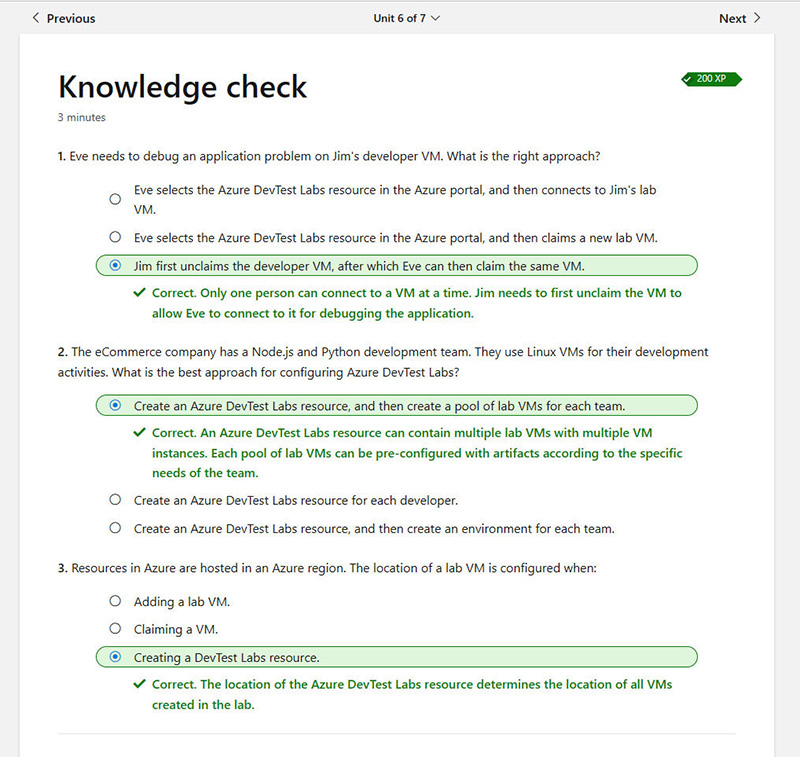
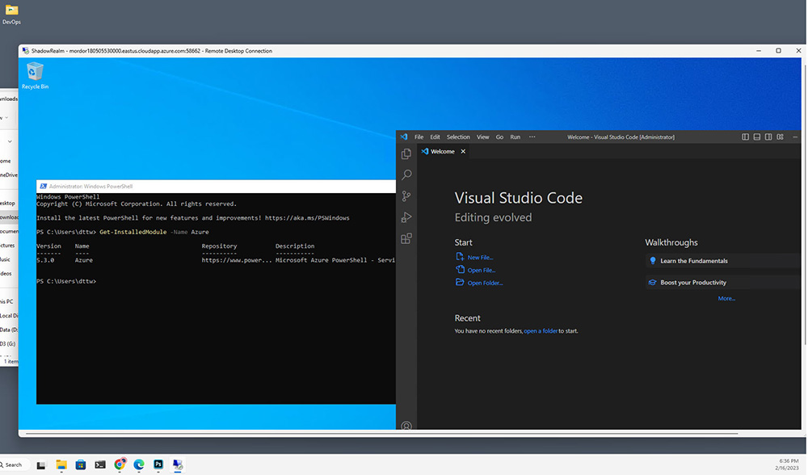
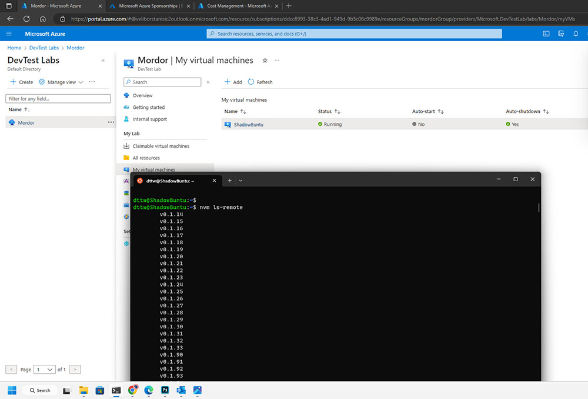

## Homework 2 - Azure DevTest Lab and VM setup

 

Exercise: Read through the [document](https://learn.microsoft.com/en-us/training/modules/set-up-first-lab-with-azure-devtest-labs/1-introduction), answer the questionnaire, setup your first development labs, connect to your VM's and take screenshots.

 

* Answers:  
  

 

* VM 1 - Windows Server and selected artifacts: Azure PowerShell(and the command output) and Visual Studio Code:  
  

 

* VM 2 - Ubuntu (via SSH from WSL2) with the output from the selected artifact NVM:  
