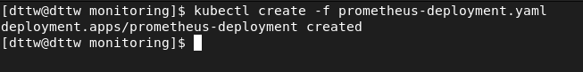

## Homework 21 - Monitoring

### Create a Namespace & ClusterRole  

Execute the following comand to create a new namespace named monitoring  

```
kubectl create namespace monitoring
```

  

Step 1: Create a file named clusterRole.yaml  

```yaml
apiVersion: rbac.authorization.k8s.io/v1
kind: ClusterRole
metadata:
  name: prometheus
rules:
- apiGroups: [""]
  resources:
  - nodes
  - nodes/proxy
  - services
  - endpoints
  - pods
  verbs: ["get", "list", "watch"]
- apiGroups:
  - extensions
  resources:
  - ingresses
  verbs: ["get", "list", "watch"]
- nonResourceURLs: ["/metrics"]
  verbs: ["get"]
---
apiVersion: rbac.authorization.k8s.io/v1
kind: ClusterRoleBinding
metadata:
  name: prometheus
roleRef:
  apiGroup: rbac.authorization.k8s.io
  kind: ClusterRole
  name: prometheus
subjects:
- kind: ServiceAccount
  name: default
  namespace: monitoring
```  

Step 2: Create the role  

```
kubectl create -f clusterRole.yaml
```  

  

### Create a Config Map To Externalize Prometheus Configurations  

Step 1: Create a file called config-map.yaml

Step 2: Execute to create the config map in Kubernetes  

```
kubectl create -f config-map.yaml
```

  

### Create a Prometheus Deployment  

Step 1: Create a file prometheus-deployment.yaml  

```yaml
apiVersion: apps/v1
kind: Deployment
metadata:
  name: prometheus-deployment
  namespace: monitoring
  labels:
    app: prometheus-server
spec:
  replicas: 1
  selector:
    matchLabels:
      app: prometheus-server
  template:
    metadata:
      labels:
        app: prometheus-server
    spec:
      containers:
        - name: prometheus
          image: prom/prometheus
          args:
            - "--storage.tsdb.retention.time=12h"
            - "--config.file=/etc/prometheus/prometheus.yml"
            - "--storage.tsdb.path=/prometheus/"
          ports:
            - containerPort: 9090
          resources:
            requests:
              cpu: 500m
              memory: 500M
            limits:
              cpu: 1
              memory: 1Gi
          volumeMounts:
            - name: prometheus-config-volume
              mountPath: /etc/prometheus/
            - name: prometheus-storage-volume
              mountPath: /prometheus/
      volumes:
        - name: prometheus-config-volume
          configMap:
            defaultMode: 420
            name: prometheus-server-conf
  
        - name: prometheus-storage-volume
          emptyDir: {}
```

Step 2: Create a deployment on monitoring namespace  

```
kubectl create -f prometheus-deployment.yaml  
```  

  

Step 3: Check the created deployment  

```
kubectl get deployments --namespace=monitoring
```

  
  


### Connecting To Prometheus Dashboard  

#### Method 1: Using Kubectl port forwarding  

Step 1: Get the Prometheus pod name

```
kubectl get pods --namespace=monitoring
```

  

Step 2: Port forwarding  

```
kubectl port-forward prometheus-deployment-954488b65-j96rr 8080:9090 -n monitoring
```  

  
