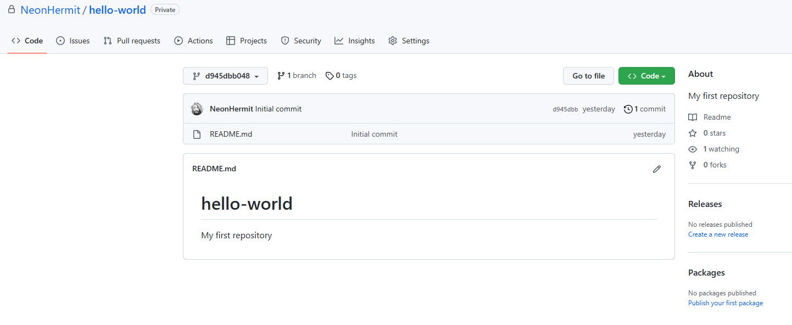
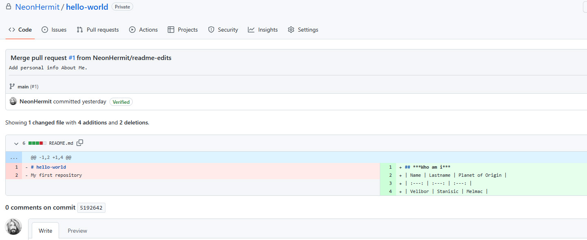
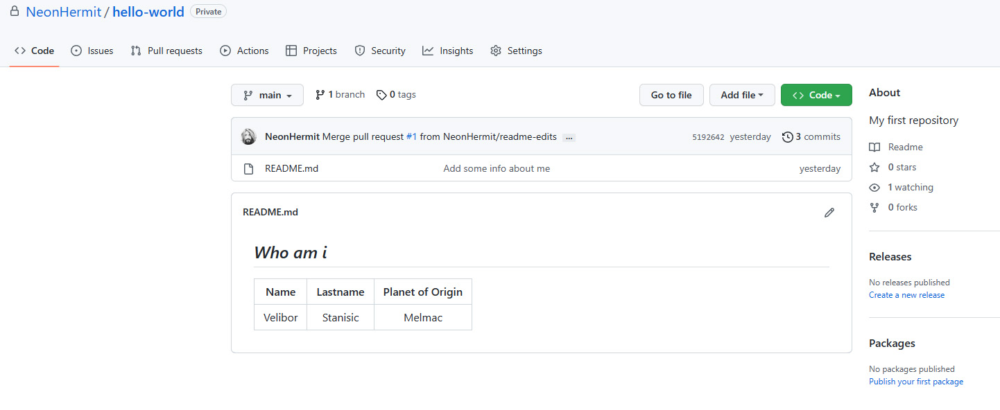

## Homework 3 - Get Started With Github

 

Exercise: Create a private repo that includes a README.md and a short description. After that create a branch called *readme-edits* (which is a copy of *main*) and open, edit the README.md and commit the changes. Final steps include creating a pull request(add a title and a brief description) and merging the changes with the *main* branch. Last, but not least after the pull request is merged and our changes are on *main* we delete the *readme-edits* branch.

 

* Create a new (private) repository:  

 

* Merge pull request:  

 

* Final :) :

