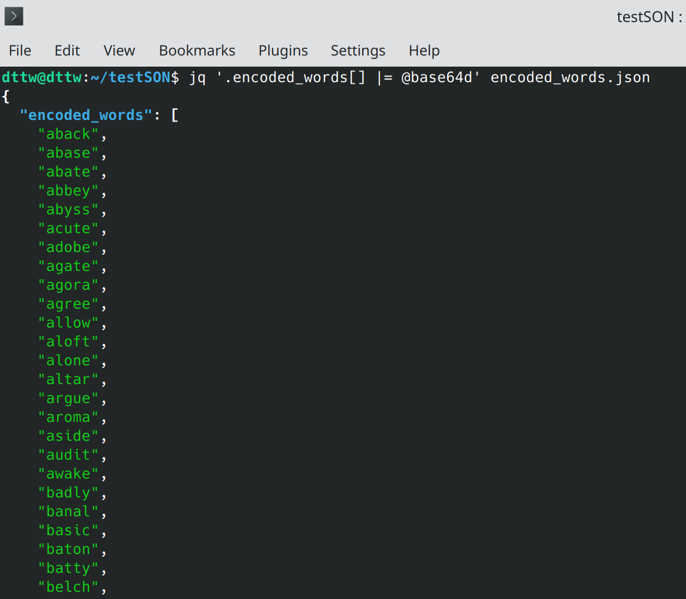

## Homework 5 - Python Wordle

<br/>

Wordle clone with Jupyter Notebook  
  

<br/>

*Note:* I made a mistake and forgot that one cannot simply base64 --decode a .json file (from command line).  
It should be:
```bash
wget <url>
jq '.encoded_words[] |= @base64d' encoded_words.json 
``` 
  
