## Homework 6 - Basic Linux Commands

 

On Hyper-V/Oracle/VMware (whatever your preferred Linux workaround is currently) download Ubuntu image and install it as a virtual machine or WSL2. After this is done:  

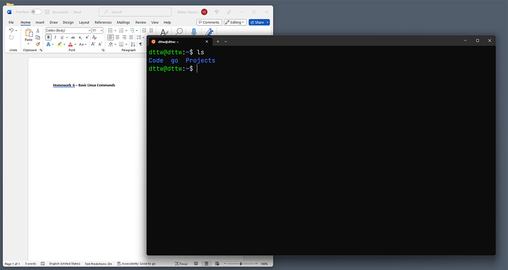

 

1. Create a file friends.txt with a list of names of three of your friends on separate lines.
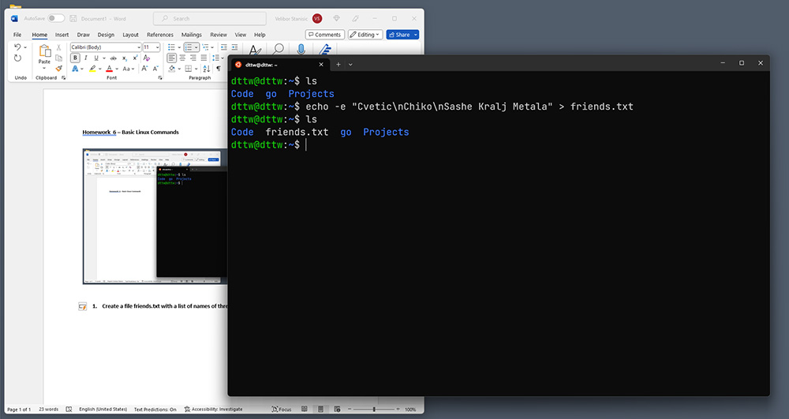  

2. Display the contents of friends.txt on the console.
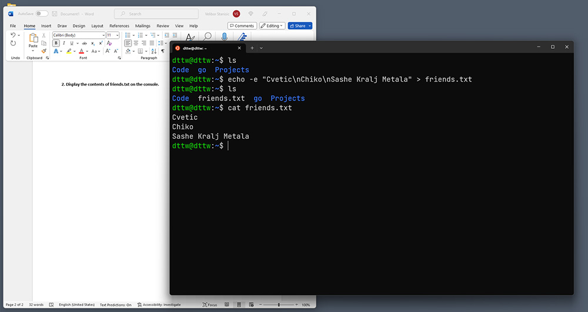

3. Rename file friends.txt to bestfriends.txt
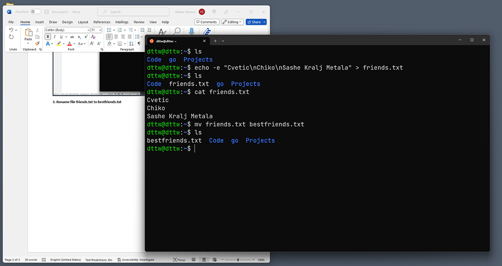

4. Make a copy of bestfriends.txt under the name sysadmins.txt
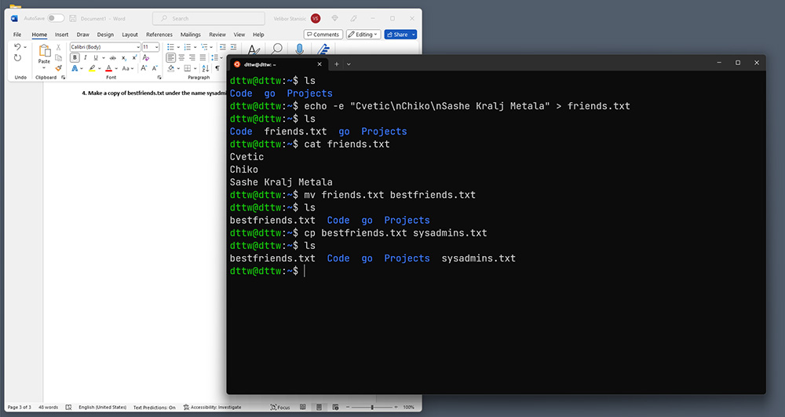

5. List all files whose name begins with letter 'b' and ends with extension txt.
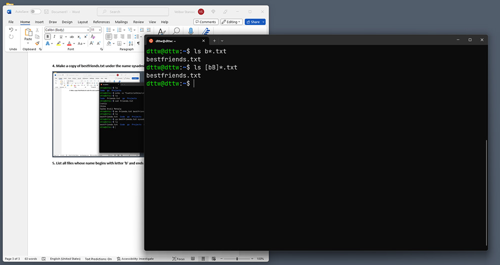

6. Write a command that will tell you how many bytes are taken up by file sysadmins.txt
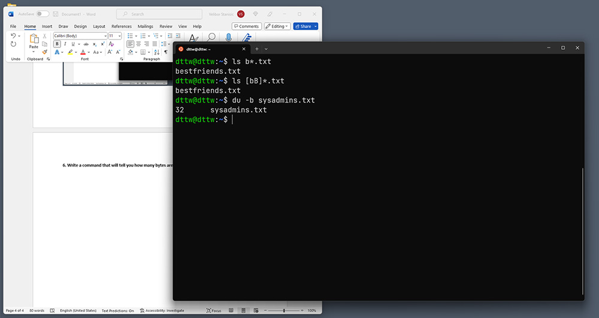

7. Create file cars.txt with a list of 5 brands of cars on separate lines.
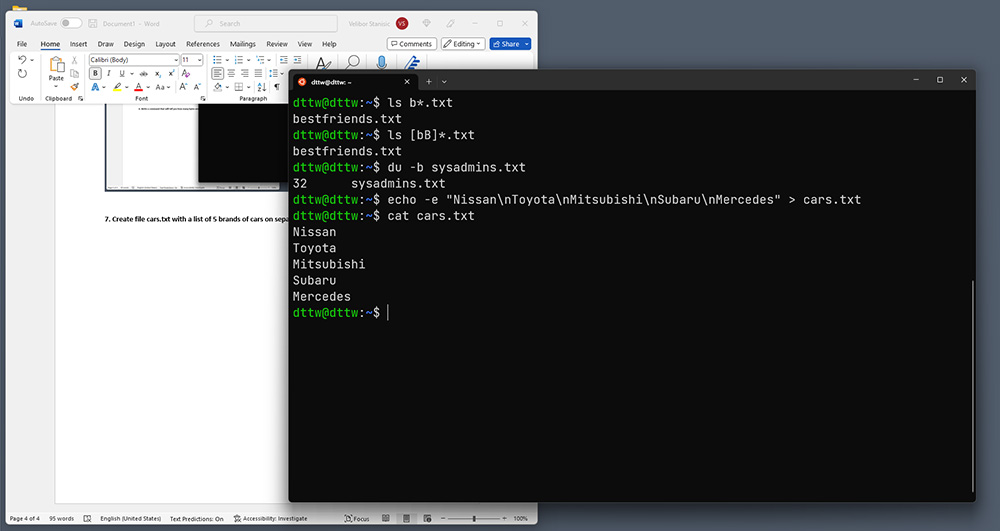

8. Check how many bytes are taken up by the file.
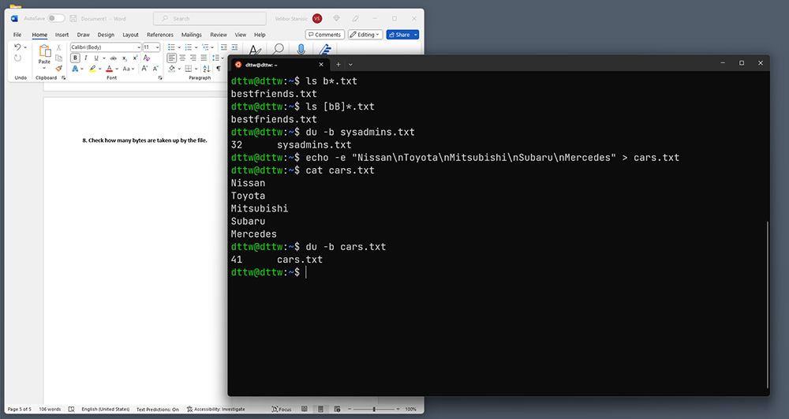

9. Copy the file cars.txt into directory /tmp
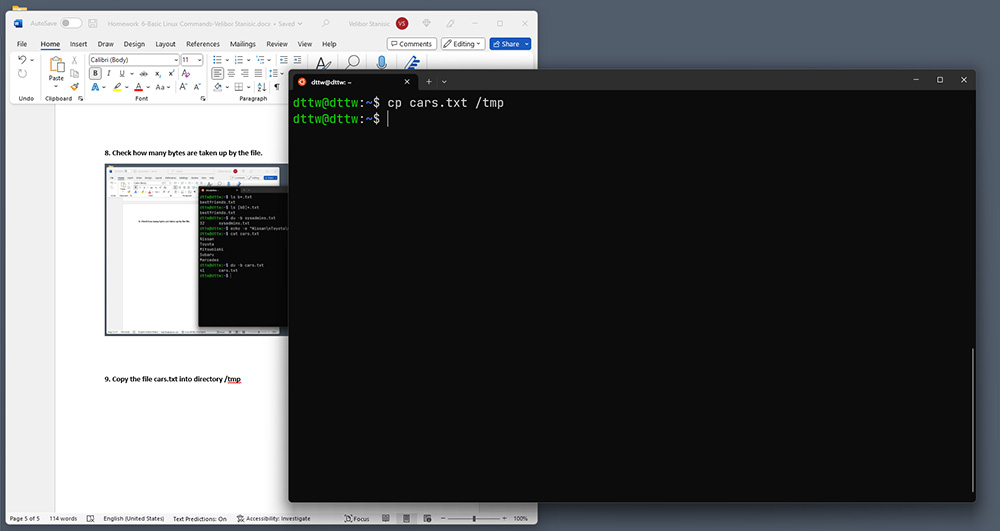

10. List all files with extension *.txt in directory /tmp and verify that the file was copied properly.
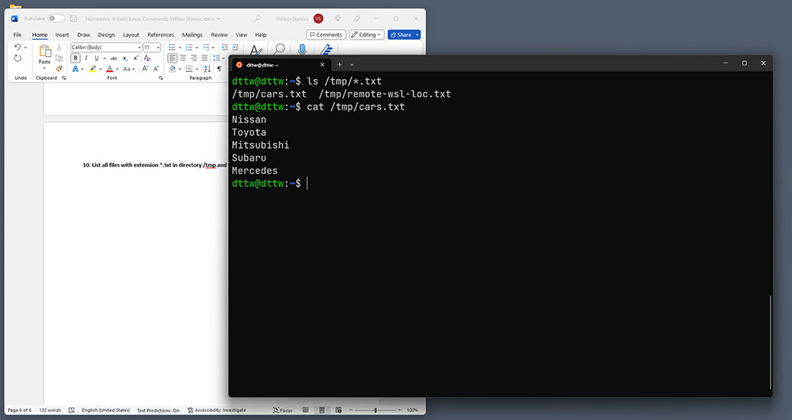

11. Without leaving your home directory rename file cars.txt located in /tmp to vehicles.txt in /tmp
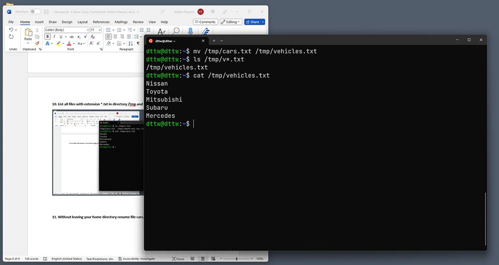

12. Display the contents of /etc/passwd file on the screen interactively (so you can search, scroll up and down)
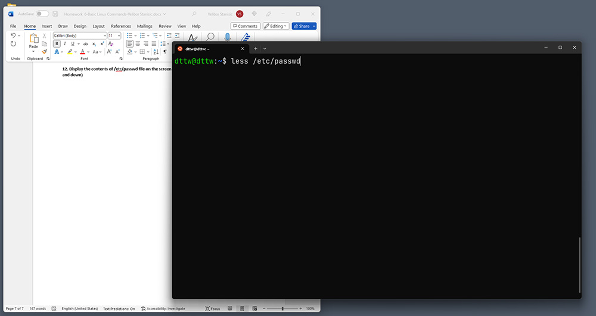