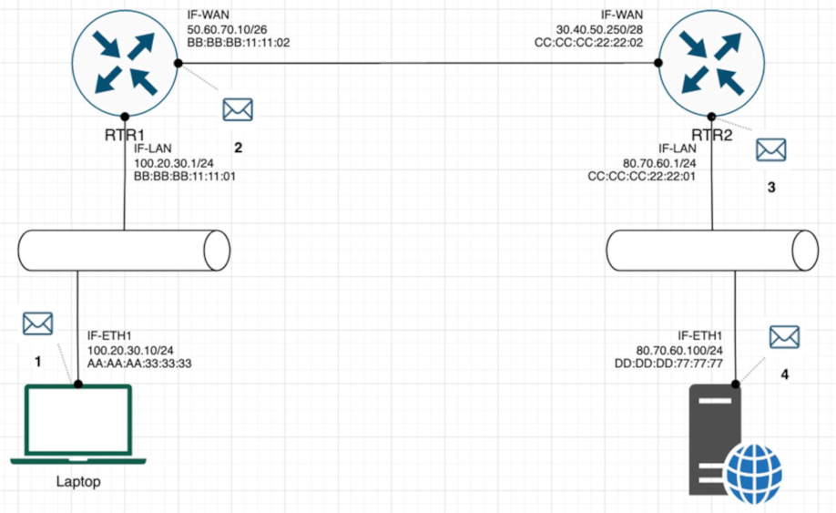

## Homework 9 - Basic Networking

 

**Exercise 1 – Basic network stuff**  
**Difficulty: Easy**  
Use the arp command and paste the output from the arp table on your system:  
Use the route command and paste the output from the routing table on your system:  
Use the traceroute command on your system and observe the hops to Google’s DNS, 8.8.8.8. Paste the full output from the command bellow showing all the hops from your system to 8.8.8.8.   
Why would you need to use the ping command?  
Answer: Write down the TCP/UDP ports of the most commonly used services bellow in the form of TCP[PORT] or UDP[PORT].  
As an example, the first two answers have been filled in: 
* HTTP – TCP80  
* SNMP – UDP161  
* HTTPS  
* DNS client  
* DNS zone transfer  
* SMTP  
* SSH  
* FTP  
* Telnet  
* MSSQL  
* MySQL  
* PostreSQL  
* RDP (Remote Desktop Protocol)  
* NTP  
* NFS  

**Exercise 2 – TCP/IP Basics**  
**Difficulty: Medium**  
Refer to the exhibit and answer the questions below. The letter symbol ✉, represents the IP packet as it travels across the network.  In the example shown, the laptop attempts to communicate with the web server in question. During its travel the packet will be forwarded across the network nodes and will eventually end up across six network interfaces before it reaches the web server. Each packet as part of the TCP/IP Stack contains fields for the source and destination MAC Address, IP Address and the TCP/UDP Port.  

**For each of the packet locations shown, 1 to 4 write down the source and destination MAC addresses of the packet as it travels across the network interfaces.**  
1. The laptop initiates communication with the web server and prepares a packet. What would the packet look like at this stage?  
* SRC IP  
* DST IP  
* SRC MAC  
* DST MAC  

2. RTR1 receives the packet on its IF-LAN interface, prepares it accordingly and forwards it out its IF-WAN. What would the packet look like at this stage?  
* SRC IP  
* DST IP  
* SRC MAC  
* DST MAC 

3. RTR2 receives the packet on its IF-WAN interface, prepares it accordingly and forwards it out via IF-LAN. What would the packet look like at this stage?  
* SRC IP  
* DST IP  
* SRC MAC  
* DST MAC  

4. The web server receives the packet and prepares a response packet back. What would the packet look like at this stage?  
* SRC IP  
* DST IP  
* SRC MAC  
* DST MAC  

**Since we are talking about web traffic (www) in the example, which transport layer protocol will most probably be used?**  
* TCP  
* UDP  

**If we do a traffic analysis with a network packet monitoring tool like WireShark, what can we expect to see for the source and destination ports when the laptop sends the packet?**  
* SRC PORT:  
* DST PORT: 

**Similarly, and vice versa, what can we expect to see as destination ports when the Web server sends a response packet back?** 
* SRC PORT: 
* DST PORT: 

**How many broadcast domains are there in the exhibit shown?**  

**Exercise 3 – Traffic analysis and identifying the OSI layers of the network packets**  
**Difficulty: Hard**  

Prerequisite:  
Search online and get familiar with the TCP’s three-way handshake. Learn how to capture the three way handshake using Wireshark. Install Wireshark on your computer and use it to capture traffic against a website or a server or your choice. It is recommended that you capture traffic against a simple website.  Name and the IP address of the website you plan to capture traffic:  

**Analyze the TCP’s three-way handshake and using screenshots from the Wireshark window answer the questions bellow:**  
1. What is the source IP (of the initiating host):  
2. What is the destination IP? (target website): 

**Identify the Network Interface (Layer 1 & 2) section of the SYN packet and paste a screenshot from it:** 
<- Paste a screenshot of the Layer 2 details section here -> 

**Identify the Network Layer 3 section of the SYN/ACK packet and paste a screenshot from it:**  
<- Paste a screenshot of the Layer 3 details section here -> 

**Identify the Transport Layer 4 section of the ACK packet and paste a screenshot from it bellow:**  
<- Paste a screenshot of the Layer 4 details section here -> 

Look closely at the L2 section of the three-way handshake packet details. Each of them shows the source and destination MAC address of the packets.  
**Who is the owner of the destination MAC address of the SYN packet?**  

**Exercise 4 – Hacking mockup (for Bonus points)**  
**Difficulty: Very hard**  
Use Wireshark to capture the packet’s application layer data and discover the implications of using unencrypted communication over a network.  
It is recommended that you use your own Linux Virtual Machine on your system on which you need to confiture a telnet server. From your own system try to login with a Telnet on the target VM all while capturing the traffic with a Wireshark.  
As a proof of competition for this exercise paste in bellow a screenshot of the application layer data containing visible username and password